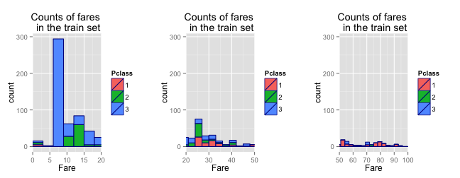
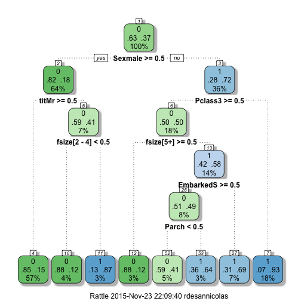

# Overview

The sinking of the RMS Titanic is one of the most infamous shipwrecks in history.  On April 15, 1912, during her maiden voyage, the Titanic sank after colliding with an iceberg, killing 1502 out of 2224 passengers and crew. This sensational tragedy shocked the international community and led to better safety regulations for ships.

One of the reasons that the shipwreck led to such loss of life was that there were not enough lifeboats for the passengers and crew. Although there was some element of luck involved in surviving the sinking, some groups of people were more likely to survive than others, such as women, children, and the upper-class.

In this challenge, we ask you to complete the analysis of what sorts of people were likely to survive. In particular, we ask you to apply the tools of machine learning to predict which passengers survived the tragedy.

# Data

File Name        | Available Formats
-----------------|------------------
train            | .csv (59.76 kb)
gendermodel      | .csv (3.18 kb)
genderclassmodel | .csv (3.18 kb)
test             | .csv (27.96 kb)

# Variables description

Name            | Description
----------------|-------------
survival        | Survival (0 = No; 1 = Yes)
pclass          | Passenger Class (1 = 1st; 2 = 2nd; 3 = 3rd)
name            | Name
sex             | Sex
age             | Age
sibsp           | Number of Siblings/Spouses Aboard
parch           | Number of Parents/Children Aboard
ticket          | Ticket Number
fare            | Passenger Fare
cabin           | Cabin
embarked        | Port of Embarkation (C = Cherbourg; Q = Queenstown; S = Southampton)

*Special notes:*

*- Pclass is a proxy for socio-economic status (SES)*  
*1st ~ Upper; 2nd ~ Middle; 3rd ~ Lower*

*- Age is in Years; Fractional if Age less than One (1)*  
*If the Age is Estimated, it is in the form xx.5*

*With respect to the family relation variables (i.e. sibsp and parch) some relations were ignored.  The following are the definitions used for sibsp and parch.*

*- Sibling:  Brother, Sister, Stepbrother, or Stepsister of Passenger Aboard Titanic*

*- Spouse:   Husband or Wife of Passenger Aboard Titanic (Mistresses and Fiances Ignored)*

*- Parent:   Mother or Father of Passenger Aboard Titanic*

*- Child:    Son, Daughter, Stepson, or Stepdaughter of Passenger Aboard Titanic*

*Other family relatives excluded from this study include cousins, nephews/nieces, aunts/uncles, and in-laws.  Some children travelled only with a nanny, therefore parch=0 for them.  As well, some travelled with very close friends or neighbors in a village, however, the definitions do not support such relations.*

# Loading the files


```r
train = read.csv('train.csv');
test = read.csv('test.csv');
```

# Exploratory Analysis

First, let's have a look at the data from the train set.

```r
head(train)
```

```
##   PassengerId Survived Pclass
## 1           1        0      3
## 2           2        1      1
## 3           3        1      3
## 4           4        1      1
## 5           5        0      3
## 6           6        0      3
##                                                  Name    Sex Age SibSp
## 1                             Braund, Mr. Owen Harris   male  22     1
## 2 Cumings, Mrs. John Bradley (Florence Briggs Thayer) female  38     1
## 3                              Heikkinen, Miss. Laina female  26     0
## 4        Futrelle, Mrs. Jacques Heath (Lily May Peel) female  35     1
## 5                            Allen, Mr. William Henry   male  35     0
## 6                                    Moran, Mr. James   male  NA     0
##   Parch           Ticket    Fare Cabin Embarked
## 1     0        A/5 21171  7.2500              S
## 2     0         PC 17599 71.2833   C85        C
## 3     0 STON/O2. 3101282  7.9250              S
## 4     0           113803 53.1000  C123        S
## 5     0           373450  8.0500              S
## 6     0           330877  8.4583              Q
```

```r
dim(train) # 891 * 12
```

```
## [1] 891  12
```

```r
names(train)
```

```
##  [1] "PassengerId" "Survived"    "Pclass"      "Name"        "Sex"        
##  [6] "Age"         "SibSp"       "Parch"       "Ticket"      "Fare"       
## [11] "Cabin"       "Embarked"
```

```r
str(train)
```

```
## 'data.frame':	891 obs. of  12 variables:
##  $ PassengerId: int  1 2 3 4 5 6 7 8 9 10 ...
##  $ Survived   : int  0 1 1 1 0 0 0 0 1 1 ...
##  $ Pclass     : int  3 1 3 1 3 3 1 3 3 2 ...
##  $ Name       : Factor w/ 891 levels "Abbing, Mr. Anthony",..: 109 191 358 277 16 559 520 629 417 581 ...
##  $ Sex        : Factor w/ 2 levels "female","male": 2 1 1 1 2 2 2 2 1 1 ...
##  $ Age        : num  22 38 26 35 35 NA 54 2 27 14 ...
##  $ SibSp      : int  1 1 0 1 0 0 0 3 0 1 ...
##  $ Parch      : int  0 0 0 0 0 0 0 1 2 0 ...
##  $ Ticket     : Factor w/ 681 levels "110152","110413",..: 524 597 670 50 473 276 86 396 345 133 ...
##  $ Fare       : num  7.25 71.28 7.92 53.1 8.05 ...
##  $ Cabin      : Factor w/ 148 levels "","A10","A14",..: 1 83 1 57 1 1 131 1 1 1 ...
##  $ Embarked   : Factor w/ 4 levels "","C","Q","S": 4 2 4 4 4 3 4 4 4 2 ...
```

We can observe that the train set is composed of 891 observations with 12 features. We can first see through the `str` call that some features need to be transformed into factors, such as `Survived` or `Pclass` for example, for which we already kno that they are representatives of levels.  
In the next part of the study, we are going to take a look at each feature included in this data set, so that to enhance some interesting characteristics, and so come up with a final training set cleaned up and up to be fitted with a model.  
To perform such an exploratory analysis, we create a copy of the train set so that we can make modifications without changing the original data.frame. At the end, we will see which modification is worth keeping in the analysis and so apply it to the train set destined to be fitted with a regression model.  
Let's create this copy.

```r
train.t <- train
```

## Features - PassengerId


```r
str(train.t$PassengerId)
```

```
##  int [1:891] 1 2 3 4 5 6 7 8 9 10 ...
```
This feature is only representative of the identification of each passenger. It's just a count.  
It's not going to be useful in the regression model because it brings no information about the survival of each individual.

## Features - Survived


```r
str(train$Survived)
```

```
##  int [1:891] 0 1 1 1 0 0 0 0 1 1 ...
```
This is the feature we want to predict for the test set, the **outcome**.  
As we see here, it's a numeric variable which takes values 0 or 1 only.  
**0** means **death**  
**1** means **survival**
So this is a binary outcome.  
Whatever will be the model fitted to this set, it's going to be better to transform this variable into a factor variable, for example to perform a logistic regression, or even a decision tree or a random forest.  
So we transform it into a factor variable.

```r
train.t$Survived <- factor(train.t$Survived)
```
Now we have this factor variable, let's have a look at the number of persons who survived in the training set and the one who died.


So we can see here that the train set presents 342 persons who survived against 549 persons who died, 38.38% of survival against 61.62% of death.


```r
table(train$Survived)
```

```
## 
##   0   1 
## 549 342
```

## Features - Pclass


```r
str(train.t$Pclass)
```

```
##  int [1:891] 3 1 3 1 3 3 1 3 3 2 ...
```
`Pclass` is a numeric variable whoch represents the class to which each passenger is attributed. This variable has 3 levels :

 - 1 : Upper class
 - 2 : Middle class
 - 3 : Lower class

Let's first transform this feature as a factor variable.

```r
train.t$Pclass <- factor(train.t$Pclass)
```
This feature is certainly strongly correlated with the probabilty of survival.
Let's plot this relationship.


```r
table(train.t$Pclass, train.t$Survived)
```

```
##    
##       0   1
##   1  80 136
##   2  97  87
##   3 372 119
```


So here, we can see that :

 - In class 3, 75.76% of passengers died ( 372 passengers over 491 ).
 - Among dead people, 67.76% of passengers come from class 3

So the `Pclass` variable is strongly related to the chances of survival, especially saying that people coming from the third class have a large probabilty of dying.

But we can see that comming from the second or the first class doesn't make any real difference in the chances of survival. We can keep that in mind so that if the model we are going to fit farther in that study may overfit, we could for example reduce the levels of the `Pclass` variable to 2, by just considering the third class and the others.  
For the moment, we are keepping it the way it originally is.

## Features - Name


```r
str(train.t$Name)
```

```
##  Factor w/ 891 levels "Abbing, Mr. Anthony",..: 109 191 358 277 16 559 520 629 417 581 ...
```
This `Name` variable is a factor variable with 891 levels. As, the number of rows in this train set is 891, we can say that no one has the same complete name.  
Let's look at how a name is written.

```r
train.t$Name[1]
```

```
## [1] Braund, Mr. Owen Harris
## 891 Levels: Abbing, Mr. Anthony ... Zimmerman, Mr. Leo
```
So we've got first the surname, a coma, the title, and then the first and second name.
What we could do here is separate those three parts, the surname, the title, and the first and second name, so that to create a new feature `Title` and another new feature `Surname`.  
Let's do it.

```r
train.t$Name <- as.character(train.t$Name)

train.t$Title <- sapply(train.t$Name, FUN=function(x){strsplit(x, split='[,.]')[[1]][[2]]})
train.t$Title <- sub(' ','',train.t$Title)

train.t$Surname <- sapply(train.t$Name, FUN=function(x){strsplit(x, split='[,.]')[[1]][[1]]})
```
So, now, we have added 2 new features to the train set, which are :

 - `Surname` : which represents the surname of each passenger
 - `Title` : which represents the title of each passenger

Those features are character variables.

We can have a look at how many unique surnames and title are there in this set.

```r
length(unique(train.t$Title))
```

```
## [1] 17
```

```r
length(unique(train.t$Surname))
```

```
## [1] 667
```
So we have got 17 different titles and 667 different names.  
That means that we have got several passengers that have got the same title and the same name.  
The differents titles are :

```r
unique(train.t$Title)
```

```
##  [1] "Mr"           "Mrs"          "Miss"         "Master"      
##  [5] "Don"          "Rev"          "Dr"           "Mme"         
##  [9] "Ms"           "Major"        "Lady"         "Sir"         
## [13] "Mlle"         "Col"          "Capt"         "the Countess"
## [17] "Jonkheer"
```
Let's have a look at the chances of survival depending on the title.


```r
table(train.t$Title, train.t$Survived)
```

```
##               
##                  0   1
##   Capt           1   0
##   Col            1   1
##   Don            1   0
##   Dr             4   3
##   Jonkheer       1   0
##   Lady           0   1
##   Major          1   1
##   Master        17  23
##   Miss          55 127
##   Mlle           0   2
##   Mme            0   1
##   Mr           436  81
##   Mrs           26  99
##   Ms             0   1
##   Rev            6   0
##   Sir            0   1
##   the Countess   0   1
```
Here we see that `Mr` are more likely to die, and that `Miss` and `Mrs` are more likely to survive. We also see that the most represented categories are `Mr`, `Master`, `Miss`, `Mrs`. We also observe that the category `Rev`, regrouping reverends, is composed only of dead passengers.  
`Master` seems to represents the unmarried men.  
`Mrs` and `Mme` are for married women.  
The other categories are completely not significant in terms of number of passenger in comparison.  
Here, what we can do is grouping categories together.

```r
train.t$tit <- "Other"
train.t$tit[train.t$Title %in% c("Capt","Col","Don", "Dr","Jonkheer", "Major")] <- "Special"
train.t$tit[train.t$Title %in% c("Lady", "Mme", "Mrs", "Ms", "the Countess")] <- "Mrs"
train.t$tit[train.t$Title %in% c("Master")] <- "Master"
train.t$tit[train.t$Title %in% c("Miss", "Mlle")] <- "Miss"
train.t$tit[train.t$Title %in% c("Mr", "Sir")] <- "Mr"
train.t$tit[train.t$Title %in% c("Rev")] <- "Rev"

table(train.t$tit, train.t$Survived)
```

```
##          
##             0   1
##   Master   17  23
##   Miss     55 129
##   Mr      436  82
##   Mrs      26 103
##   Rev       6   0
##   Special   9   5
```


As we have created another more convenient variable, `tit`, the `Title` variable is no longer useful for us.  

Now that we have taken care of the titles, let's look at the surnames.
As we have seen above, we have got 667 different names, over 891 passengers, which means that we have got relatives, being wives and husband, or children, or brothers and sisters.  
We know that there are 2 variables in this dataset that are about parental relationship, `SibSp` and `Parch`. So as the surname can only tells us if relationship has an incidence on survival, we will deal with this when we look at the 2 features quoted above.

## Features - Sex


```r
str(train.t$Sex)
```

```
##  Factor w/ 2 levels "female","male": 2 1 1 1 2 2 2 2 1 1 ...
```
This is a factor variable, which takes "male" or "female" value.
Let's have a look at the distribution of survival depending on this feature.


So this plot tells us that a man is more likely to die than a woman.  
But the question that we may be wondering is : is this information already available with the `tit` variable which is about the passengers'title?  

Let's check that all the "female" are in the "Mrs" or "Miss" category.

```r
femsub <- subset(train.t,train.t$Sex == "female" & (train.t$tit != "Miss" & train.t$tit != "Mrs"))
head(femsub)
```

```
##     PassengerId Survived Pclass                        Name    Sex Age
## 797         797        1      1 Leader, Dr. Alice (Farnham) female  49
##     SibSp Parch Ticket    Fare Cabin Embarked Title Surname     tit
## 797     0     0  17465 25.9292   D17        S    Dr  Leader Special
```
So we see that there is only one woman that is not in one of those 2 categories because she is a doctor, and so she has been classified in the "Special" category.  
So we won't take this variable into account as it's redundant with the `tit` variable.

## Features - Age


```r
str(train.t$Age)
```

```
##  num [1:891] 22 38 26 35 35 NA 54 2 27 14 ...
```

```r
summary(train.t$Age)
```

```
##    Min. 1st Qu.  Median    Mean 3rd Qu.    Max.    NA's 
##    0.42   20.12   28.00   29.70   38.00   80.00     177
```

```r
propNA <- round(sum(is.na(train.t$Age))/nrow(train.t),4)
```
Here we see that we have got 19.87% of NA values in the `Age` feature.  
We suppose that this feature is significant in predicting the survival probabilty. We may think of several options :

 - We can take all the NA values (whole rows) out of the dataset and fit a model on the left rows. But, looking at the test set, we see that there are also NA values in the test set. So if we decide to erase those rows, it's because we don't think of using this feature as a predictor in our model...
 - We can also calculate an "average" value to replace the NA values and so use this variable as a predictor in our model. But we will introduce this way an error in our model as the values we will replace the NAs with won't be accurate.
 - We can try to find a relationship with other values, and maybe categorized this feature this way so that the error introduced in the model is less significant (or even completely inexistant).  
 
Let's try to find a relationship between `Age` and other variables in this dataset.


```r
length(unique(train.t$Age))
```

```
## [1] 89
```

```r
range(train.t$Age, na.rm = TRUE)
```

```
## [1]  0.42 80.00
```
Let's try to make some categories depending on a range of Age, and look at the proportion of survivals in each category.

```r
cat <- seq(0,80, by = 5)
train.t$AgeC <- cut(train.t$Age, cat)

a <- table(train.t$AgeC[!is.na(train.t$AgeC)], train.t$Survived[!is.na(train.t$AgeC)])
a <- data.frame("0" = a[,1], "1" = a[,2])
for (i in 1:(length(cat)-1)){
    a$prop[i] <- round(as.double(a[i,2]/(a[i,1]+a[i,2])),4)
}
a
```

```
##         X0 X1   prop
## (0,5]   13 31 0.7045
## (5,10]  13  7 0.3500
## (10,15]  8 11 0.5789
## (15,20] 63 33 0.3438
## (20,25] 80 42 0.3443
## (25,30] 66 42 0.3889
## (30,35] 47 41 0.4659
## (35,40] 39 28 0.4179
## (40,45] 30 17 0.3617
## (45,50] 23 16 0.4103
## (50,55] 14 10 0.4167
## (55,60] 11  7 0.3889
## (60,65] 10  4 0.2857
## (65,70]  3  0 0.0000
## (70,75]  4  0 0.0000
## (75,80]  0  1 1.0000
```

Let's plot this.

For now, we cannot yet see any relationship between `AgeC` variable and any other category.  
We are going to clean up the other catagories and then come back to this to find a relationship.

## Features - SibSp & Parch


```r
str(train.t$SibSp)
```

```
##  int [1:891] 1 1 0 1 0 0 0 3 0 1 ...
```

```r
str(train.t$Parch)
```

```
##  int [1:891] 0 0 0 0 0 0 0 1 2 0 ...
```
`SibSp` tells us that the passenger has a brother, sister, husband or wife aboard the Titanic.  
`Parch` tells us that the passenger has a mother, father, son or daughter aboard the Titanic.  

What we can do here is first creating a new variable attributing the size of the family aboard the Titanic, by summing `SibSp`, `Parch`, and 1 for the passenger.

```r
train.t$famsize <- train.t$SibSp + train.t$Parch + 1
```
We can suppose that there is a relationship between being accompanied aboard and the chances of survival.  
Let's have a look at this.


```r
b <- table(train.t$famsize, train.t$Survived)
b <- data.frame("0" = b[,1],"1" =  b[,2])
b$prop <- round(b$X1/(b$X1+b$X0),4)
b
```

```
##     X0  X1   prop
## 1  374 163 0.3035
## 2   72  89 0.5528
## 3   43  59 0.5784
## 4    8  21 0.7241
## 5   12   3 0.2000
## 6   19   3 0.1364
## 7    8   4 0.3333
## 8    6   0 0.0000
## 11   7   0 0.0000
```
We can get some trends here :

 - passengers alone(famsize = 1) are more likely to die
 - passengers with a family size of 2 to 4 are more likely to survive
 - passengers with a family size of 5 or more are more likely to die

We can so subset family size into 3 categories :

 - family size = 1
 - family size = 2 to 4
 - family size = 5 or more

Let's try this subsetting.

```r
train.t$fsize[train.t$famsize == 1] <- "[1]"
train.t$fsize[train.t$famsize >1 & train.t$famsize<5] <- "[2 - 4]"
train.t$fsize[train.t$famsize >4] <- "[5+]"
train.t$fsize <- factor(train.t$fsize)
```


```r
b <- table(train.t$fsize, train.t$Survived)
b <- data.frame("0" = b[,1],"1" =  b[,2])
b$prop <- round(b$X1/(b$X1+b$X0),4)
b
```

```
##          X0  X1   prop
## [1]     374 163 0.3035
## [2 - 4] 123 169 0.5788
## [5+]     52  10 0.1613
```

## Features - Ticket


```r
str(train.t$Ticket)
```

```
##  Factor w/ 681 levels "110152","110413",..: 524 597 670 50 473 276 86 396 345 133 ...
```
As we can see, there are 681 levels for this factor variable. It means that, as there are no NA values, several passengers have the same ticket number.  
By having a look at different ticket numbers, it seems that the ticket number links several passengers from the same family. I suppose that the ticket number depends on the command that has been made, and a same ticket number may be attributed to several passengers being part of the same command.  
We will leave it this way as it should be useful to link several family members.  

## Features - Fare


```r
str(train.t$Fare)
```

```
##  num [1:891] 7.25 71.28 7.92 53.1 8.05 ...
```

```r
length(unique(train.t$Fare))
```

```
## [1] 248
```

```r
summary(train.t$Fare)
```

```
##    Min. 1st Qu.  Median    Mean 3rd Qu.    Max. 
##    0.00    7.91   14.45   32.20   31.00  512.30
```
This is a numeric variable.  
We can see that there are only 248 unique fares, meaning that several passengers paid the same fare.  
The fares go from 0 to 512 $.  
Let's first have a look at the distribution of fares.




What is the fare related with?  

So, it seems that according to the class, the mean of fares are different.
We could think of categorizing fares by group of range 10$ each.

```r
fgroup <- seq(0,100, by=10)
fgroup <- c(fgroup, 1000)

train.t$farecut <- cut(train.t$Fare, fgroup)
train.t$farecut[is.na(train.t$farecut)] <- "(0,10]"
```

Let's make a plot to see the relationship between those new categories and survival.


## Features - Cabin


```r
str(train.t$Cabin)
```

```
##  Factor w/ 148 levels "","A10","A14",..: 1 83 1 57 1 1 131 1 1 1 ...
```

```r
sum(train.t$Cabin == "")
```

```
## [1] 687
```
This variable is a factor variable. There are 148 different cabins here.  
As we can see, there are 687 observations that don't state any cabin.  
Is the cabin number related to survival?


```r
subCab <- train.t[train.t$Cabin != "",]
propCab <- round(sum(as.numeric(as.character(subCab$Survived)))/nrow(subCab),4)
propCab
```

```
## [1] 0.6667
```
So there is a 66.67% chances that a passenger in a cabin will survive.
Is there any difference regarding the letter at the beginning of the cabin number?

```r
train.t$cab <- mapply(substr, train.t$Cabin, 1,1)
table(train.t$cab, train.t$Survived)
```

```
##    
##       0   1
##     481 206
##   A   8   7
##   B  12  35
##   C  24  35
##   D   8  25
##   E   8  24
##   F   5   8
##   G   2   2
##   T   1   0
```


So it seems that for almost all type of cabins, passengers are more likely to survive in a cabin than passengers without any cabin.

Let's transform this variable into a factor variable.

```r
train.t$cab <- factor(train.t$cab)
```


## Features - Embarked


```r
str(train.t$Embarked)
```

```
##  Factor w/ 4 levels "","C","Q","S": 4 2 4 4 4 3 4 4 4 2 ...
```

```r
summary(train.t$Embarked)
```

```
##       C   Q   S 
##   2 168  77 644
```
There are 3 levels for the `Embarked` variable. But we can also see that 2 observations doesn't have any Embarked value.
Let's plot.

So as we can see, passengers with Embarked = "S" are more likely to die than others.

We have now covered all the different variables.

We will now get back to the `Age` variable so that to be able to replace the NA values.

## Replacing NA values for Age variable

Reminder


Let's subset first the train set with all NA values for `AgeC` feature.

```r
AgeNA <- subset(train.t, is.na(train.t$AgeC))
str(AgeNA)
```

```
## 'data.frame':	177 obs. of  20 variables:
##  $ PassengerId: int  6 18 20 27 29 30 32 33 37 43 ...
##  $ Survived   : Factor w/ 2 levels "0","1": 1 2 2 1 2 1 2 2 2 1 ...
##  $ Pclass     : Factor w/ 3 levels "1","2","3": 3 2 3 3 3 3 1 3 3 3 ...
##  $ Name       : chr  "Moran, Mr. James" "Williams, Mr. Charles Eugene" "Masselmani, Mrs. Fatima" "Emir, Mr. Farred Chehab" ...
##  $ Sex        : Factor w/ 2 levels "female","male": 2 2 1 2 1 2 1 1 2 2 ...
##  $ Age        : num  NA NA NA NA NA NA NA NA NA NA ...
##  $ SibSp      : int  0 0 0 0 0 0 1 0 0 0 ...
##  $ Parch      : int  0 0 0 0 0 0 0 0 0 0 ...
##  $ Ticket     : Factor w/ 681 levels "110152","110413",..: 276 152 185 180 284 363 587 289 203 392 ...
##  $ Fare       : num  8.46 13 7.22 7.22 7.88 ...
##  $ Cabin      : Factor w/ 148 levels "","A10","A14",..: 1 1 1 1 1 1 43 1 1 1 ...
##  $ Embarked   : Factor w/ 4 levels "","C","Q","S": 3 4 2 2 3 4 2 3 2 2 ...
##  $ Title      : chr  "Mr" "Mr" "Mrs" "Mr" ...
##  $ Surname    : chr  "Moran" "Williams" "Masselmani" "Emir" ...
##  $ tit        : chr  "Mr" "Mr" "Mrs" "Mr" ...
##  $ AgeC       : Factor w/ 16 levels "(0,5]","(5,10]",..: NA NA NA NA NA NA NA NA NA NA ...
##  $ famsize    : num  1 1 1 1 1 1 2 1 1 1 ...
##  $ fsize      : Factor w/ 3 levels "[1]","[2 - 4]",..: 1 1 1 1 1 1 2 1 1 1 ...
##  $ farecut    : Factor w/ 11 levels "(0,10]","(10,20]",..: 1 2 1 1 1 1 11 1 1 1 ...
##  $ cab        : Factor w/ 9 levels "","A","B","C",..: 1 1 1 1 1 1 3 1 1 1 ...
```
We have 177 NA values from the `Age` variable.


```
## Warning: Removed 177 rows containing missing values (geom_point).
```


Here we see that we cannot find a correlation between `Fare` and `Age`.  


```
## Warning: Removed 177 rows containing missing values (geom_point).
```


As we can see through the different plots we have tried, we cannot find any sufficient relationship between the `Age` variable and any other feature so that we have confidence that age is pretty well approximated.  
Due to this fact, we will choose to fit a predictive model that doesn't take into account the `Age` variable, at first, and then, only for the observations for which we know the age, we will fit another model fitted to the previous prediciton and the `Age` variable.

# Subsetting the train set to perform cross-validation

Now that we have seen all the variables from the dataset and created any other feature needed, we are going to start model fitting.  
First we have to subset the train set so that to perform the analysis.  
We chose to practice the following subsetting :

 - **training set** : **60%** of the train set. We will fit different models to this training set so that to choose the best one for the prediction.
 - **cross-validation set** : **20%** of the train set. We will train the model fitted and choosen previously so that to optimize the tuning parameters.
 - **testing set** : **20%** of the train set. We will use this set to make predictions with th best model choosen and tuned previously to evaluate the Out of Sample error and so evaluate the accuracy of our model.

Let's subset the train set.

```r
library(caret)
```

```
## Loading required package: lattice
```

```r
set.seed(1)
inTrain <- createDataPartition(y=train$Survived, p=0.6, list=FALSE)
valid <- createDataPartition(y = train$Survived[-inTrain], p=0.5, list = FALSE)
training <- train[inTrain,]
other <- train[-inTrain,]
validating <- other[valid,]
testing <- other[-valid,]
```

## Applying modifications to the training set

Now, we are going to apply the modifications we have found useful during the exploratory analysis to the training set.

```r
# training
training$Survived <- factor(training$Survived)
training$Pclass <- factor(training$Pclass)
training$Name <- as.character(training$Name)
training$Title <- sapply(training$Name, FUN=function(x){strsplit(x, split='[,.]')[[1]][[2]]})
training$Title <- sub(' ','',training$Title)
training$Surname <- sapply(training$Name, FUN=function(x){strsplit(x, split='[,.]')[[1]][[1]]})
training$tit <- "Other"
training$tit[training$Title %in% c("Capt","Col","Don", "Dr","Jonkheer", "Major")] <- "Special"
training$tit[training$Title %in% c("Lady", "Mme", "Mrs", "Ms", "the Countess")] <- "Mrs"
training$tit[training$Title %in% c("Master")] <- "Master"
training$tit[training$Title %in% c("Miss", "Mlle")] <- "Miss"
training$tit[training$Title %in% c("Mr", "Sir")] <- "Mr"
training$tit[training$Title %in% c("Rev")] <- "Rev"
training$tit <- factor(training$tit)
cat <- seq(0,80, by = 5)
training$AgeC <- cut(training$Age, cat)
training$famsize <- training$SibSp + training$Parch + 1
training$fsize[training$famsize == 1] <- "[1]"
training$fsize[training$famsize >1 & training$famsize<5] <- "[2 - 4]"
training$fsize[training$famsize >4] <- "[5+]"
training$fsize <- factor(training$fsize)
fgroup <- seq(0,100, by=10)
fgroup <- c(fgroup, 1000)
training$farecut <- cut(training$Fare, fgroup)
training$farecut[is.na(training$farecut)] <- "(0,10]"
training$cab <- mapply(substr, training$Cabin, 1,1)
training$cab <- factor(training$cab)

str(training)
```

```
## 'data.frame':	535 obs. of  20 variables:
##  $ PassengerId: int  1 4 6 10 11 12 17 19 20 22 ...
##  $ Survived   : Factor w/ 2 levels "0","1": 1 2 1 2 2 2 1 1 2 2 ...
##  $ Pclass     : Factor w/ 3 levels "1","2","3": 3 1 3 2 3 1 3 3 3 2 ...
##  $ Name       : chr  "Braund, Mr. Owen Harris" "Futrelle, Mrs. Jacques Heath (Lily May Peel)" "Moran, Mr. James" "Nasser, Mrs. Nicholas (Adele Achem)" ...
##  $ Sex        : Factor w/ 2 levels "female","male": 2 1 2 1 1 1 2 1 1 2 ...
##  $ Age        : num  22 35 NA 14 4 58 2 31 NA 34 ...
##  $ SibSp      : int  1 1 0 1 1 0 4 1 0 0 ...
##  $ Parch      : int  0 0 0 0 1 0 1 0 0 0 ...
##  $ Ticket     : Factor w/ 681 levels "110152","110413",..: 524 50 276 133 617 39 481 302 185 153 ...
##  $ Fare       : num  7.25 53.1 8.46 30.07 16.7 ...
##  $ Cabin      : Factor w/ 148 levels "","A10","A14",..: 1 57 1 1 147 51 1 1 1 113 ...
##  $ Embarked   : Factor w/ 4 levels "","C","Q","S": 4 4 3 2 4 4 3 4 2 4 ...
##  $ Title      : chr  "Mr" "Mrs" "Mr" "Mrs" ...
##  $ Surname    : chr  "Braund" "Futrelle" "Moran" "Nasser" ...
##  $ tit        : Factor w/ 6 levels "Master","Miss",..: 3 4 3 4 2 2 1 4 4 3 ...
##  $ AgeC       : Factor w/ 16 levels "(0,5]","(5,10]",..: 5 7 NA 3 1 12 1 7 NA 7 ...
##  $ famsize    : num  2 2 1 2 3 1 6 2 1 1 ...
##  $ fsize      : Factor w/ 3 levels "[1]","[2 - 4]",..: 2 2 1 2 2 1 3 2 1 1 ...
##  $ farecut    : Factor w/ 11 levels "(0,10]","(10,20]",..: 1 6 1 4 2 3 3 2 1 2 ...
##  $ cab        : Factor w/ 9 levels "","A","B","C",..: 1 4 1 1 8 4 1 1 1 5 ...
```

We then apply those same transformations to the validating and testing sets so that we are able to perform predictions on those sets.

```r
# validating
validating$Survived <- factor(validating$Survived)
validating$Pclass <- factor(validating$Pclass)
validating$Name <- as.character(validating$Name)
validating$Title <- sapply(validating$Name, FUN=function(x){strsplit(x, split='[,.]')[[1]][[2]]})
validating$Title <- sub(' ','',validating$Title)
validating$Surname <- sapply(validating$Name, FUN=function(x){strsplit(x, split='[,.]')[[1]][[1]]})
validating$tit <- "Other"
validating$tit[validating$Title %in% c("Capt","Col","Don", "Dr","Jonkheer", "Major")] <- "Special"
validating$tit[validating$Title %in% c("Lady", "Mme", "Mrs", "Ms", "the Countess")] <- "Mrs"
validating$tit[validating$Title %in% c("Master")] <- "Master"
validating$tit[validating$Title %in% c("Miss", "Mlle")] <- "Miss"
validating$tit[validating$Title %in% c("Mr", "Sir")] <- "Mr"
validating$tit[validating$Title %in% c("Rev")] <- "Rev"
validating$tit <- factor(validating$tit)
cat <- seq(0,80, by = 5)
validating$AgeC <- cut(validating$Age, cat)
validating$famsize <- validating$SibSp + validating$Parch + 1
validating$fsize[validating$famsize == 1] <- "[1]"
validating$fsize[validating$famsize >1 & validating$famsize<5] <- "[2 - 4]"
validating$fsize[validating$famsize >4] <- "[5+]"
validating$fsize <- factor(validating$fsize)
fgroup <- seq(0,100, by=10)
fgroup <- c(fgroup, 1000)
validating$farecut <- cut(validating$Fare, fgroup)
validating$farecut[is.na(validating$farecut)] <- "(0,10]"
validating$cab <- mapply(substr, validating$Cabin, 1,1)
validating$cab <- factor(validating$cab)

str(validating)
```

```
## 'data.frame':	178 obs. of  20 variables:
##  $ PassengerId: int  5 7 14 18 25 28 32 46 51 52 ...
##  $ Survived   : Factor w/ 2 levels "0","1": 1 1 1 2 1 1 2 1 1 1 ...
##  $ Pclass     : Factor w/ 3 levels "1","2","3": 3 1 3 2 3 1 1 3 3 3 ...
##  $ Name       : chr  "Allen, Mr. William Henry" "McCarthy, Mr. Timothy J" "Andersson, Mr. Anders Johan" "Williams, Mr. Charles Eugene" ...
##  $ Sex        : Factor w/ 2 levels "female","male": 2 2 2 2 1 2 1 2 2 2 ...
##  $ Age        : num  35 54 39 NA 8 19 NA NA 7 21 ...
##  $ SibSp      : int  0 0 1 0 3 3 1 0 4 0 ...
##  $ Parch      : int  0 0 5 0 1 2 0 0 1 0 ...
##  $ Ticket     : Factor w/ 681 levels "110152","110413",..: 473 86 334 152 396 96 587 618 250 523 ...
##  $ Fare       : num  8.05 51.86 31.27 13 21.07 ...
##  $ Cabin      : Factor w/ 148 levels "","A10","A14",..: 1 131 1 1 1 65 43 1 1 1 ...
##  $ Embarked   : Factor w/ 4 levels "","C","Q","S": 4 4 4 4 4 4 2 4 4 4 ...
##  $ Title      : chr  "Mr" "Mr" "Mr" "Mr" ...
##  $ Surname    : chr  "Allen" "McCarthy" "Andersson" "Williams" ...
##  $ tit        : Factor w/ 6 levels "Master","Miss",..: 3 3 3 3 2 3 4 3 1 3 ...
##  $ AgeC       : Factor w/ 16 levels "(0,5]","(5,10]",..: 7 11 8 NA 2 4 NA NA 2 5 ...
##  $ famsize    : num  1 1 7 1 5 6 2 1 6 1 ...
##  $ fsize      : Factor w/ 3 levels "[1]","[2 - 4]",..: 1 1 3 1 3 3 2 1 3 1 ...
##  $ farecut    : Factor w/ 11 levels "(0,10]","(10,20]",..: 1 6 4 2 3 11 11 1 4 1 ...
##  $ cab        : Factor w/ 7 levels "","A","B","C",..: 1 6 1 1 1 4 3 1 1 1 ...
```


```r
# testing
testing$Survived <- factor(testing$Survived)
testing$Pclass <- factor(testing$Pclass)
testing$Name <- as.character(testing$Name)
testing$Title <- sapply(testing$Name, FUN=function(x){strsplit(x, split='[,.]')[[1]][[2]]})
testing$Title <- sub(' ','',testing$Title)
testing$Surname <- sapply(testing$Name, FUN=function(x){strsplit(x, split='[,.]')[[1]][[1]]})
testing$tit <- "Other"
testing$tit[testing$Title %in% c("Capt","Col","Don", "Dr","Jonkheer", "Major")] <- "Special"
testing$tit[testing$Title %in% c("Lady", "Mme", "Mrs", "Ms", "the Countess")] <- "Mrs"
testing$tit[testing$Title %in% c("Master")] <- "Master"
testing$tit[testing$Title %in% c("Miss", "Mlle")] <- "Miss"
testing$tit[testing$Title %in% c("Mr", "Sir")] <- "Mr"
testing$tit[testing$Title %in% c("Rev")] <- "Rev"
testing$tit <- factor(testing$tit)
cat <- seq(0,80, by = 5)
testing$AgeC <- cut(testing$Age, cat)
testing$famsize <- testing$SibSp + testing$Parch + 1
testing$fsize[testing$famsize == 1] <- "[1]"
testing$fsize[testing$famsize >1 & testing$famsize<5] <- "[2 - 4]"
testing$fsize[testing$famsize >4] <- "[5+]"
testing$fsize <- factor(testing$fsize)
fgroup <- seq(0,100, by=10)
fgroup <- c(fgroup, 1000)
testing$farecut <- cut(testing$Fare, fgroup)
testing$farecut[is.na(testing$farecut)] <- "(0,10]"
testing$cab <- mapply(substr, testing$Cabin, 1,1)
testing$cab <- factor(testing$cab)

str(testing)
```

```
## 'data.frame':	178 obs. of  20 variables:
##  $ PassengerId: int  2 3 8 9 13 15 16 21 23 26 ...
##  $ Survived   : Factor w/ 2 levels "0","1": 2 2 1 2 1 1 2 1 2 2 ...
##  $ Pclass     : Factor w/ 3 levels "1","2","3": 1 3 3 3 3 3 2 2 3 3 ...
##  $ Name       : chr  "Cumings, Mrs. John Bradley (Florence Briggs Thayer)" "Heikkinen, Miss. Laina" "Palsson, Master. Gosta Leonard" "Johnson, Mrs. Oscar W (Elisabeth Vilhelmina Berg)" ...
##  $ Sex        : Factor w/ 2 levels "female","male": 1 1 2 1 2 1 1 2 1 1 ...
##  $ Age        : num  38 26 2 27 20 14 55 35 15 38 ...
##  $ SibSp      : int  1 0 3 0 0 0 0 0 0 1 ...
##  $ Parch      : int  0 0 1 2 0 0 0 0 0 5 ...
##  $ Ticket     : Factor w/ 681 levels "110152","110413",..: 597 670 396 345 536 414 154 140 279 330 ...
##  $ Fare       : num  71.28 7.92 21.07 11.13 8.05 ...
##  $ Cabin      : Factor w/ 148 levels "","A10","A14",..: 83 1 1 1 1 1 1 1 1 1 ...
##  $ Embarked   : Factor w/ 4 levels "","C","Q","S": 2 4 4 4 4 4 4 4 3 4 ...
##  $ Title      : chr  "Mrs" "Miss" "Master" "Mrs" ...
##  $ Surname    : chr  "Cumings" "Heikkinen" "Palsson" "Johnson" ...
##  $ tit        : Factor w/ 6 levels "Master","Miss",..: 4 2 1 4 3 2 4 3 2 4 ...
##  $ AgeC       : Factor w/ 16 levels "(0,5]","(5,10]",..: 8 6 1 6 4 3 11 7 3 8 ...
##  $ famsize    : num  2 1 5 3 1 1 1 1 1 7 ...
##  $ fsize      : Factor w/ 3 levels "[1]","[2 - 4]",..: 2 1 3 2 1 1 1 1 1 3 ...
##  $ farecut    : Factor w/ 11 levels "(0,10]","(10,20]",..: 8 1 3 2 1 1 2 3 1 4 ...
##  $ cab        : Factor w/ 7 levels "","A","B","C",..: 4 1 1 1 1 1 1 1 1 1 ...
```

# Fitting models

Now that we have shaped data conveniently to perform our analysis, we are going here to fit different models so that to make the best possible predictions regarding the probability of passengers'survival.  
Here the **outcome**, e.g. the variable we want to predict, is `Survived` which takes only 2 values : 1 for survival and 0 for death.  
Therefore, we will have to predict the probabilty of survival, depending on a set of features. This probability is therefore a value between 0 and 1.  
Because of that, we can think of several prediction models that could fit to our data :

 - Logistic regression
 - Decision Trees
 - Bagging
 - Random Forest
 - Boosting
 - SVM (support Vector Machine)

We are going to first set our **baseline** models, being the models to which we will compare our other models fitted so that to be sure that our predictions are better to those baseline models.  
After defining those baseline models, we will start by creating a model from logistic regression. This will allow us to uderstand and interpret the relationship between features, and so to choose more wisely the features to take into account in our model.  
Then, and finally, we will try the other models quoted above with the same features and check if the accuracy obtained is better or not.  

## Baseline models

Here are our 2 baseline models :

 - **Gender model** : this one is based on the gender of the passengers, saying assigning to all passengers from the same gender the probability (found in the training data set) of this gender's survival.
 - **Gender/Class model** : this one goes a liitle bit further than the previous one, this time taking into account the class where the passengers are from.

### Baseline - Gender Model

Let's have a look at the distribution of gender's survival in the training set.

So what we see here is that a male is more likely to die than a women.  
Let's evaluate this probability.

```r
a <- table(training$Sex, training$Survived)
a <- data.frame("0" = a[,1], "1" = a[,2])
a$prob <- a$X1/(a$X1+a$X0)
a
```

```
##         X0  X1     prob
## female  54 138 0.718750
## male   281  62 0.180758
```
So, as we see here, a woman has around 72% chances of survival, whereas a man has only 18% chances of survival.  
Therefore, this simple baseline gender model is going to state that a woman is going to survive and that a man is going to die.

Let's create the prediciton's vector.

```r
# Predictions on training set
trainingPredfit01 <- rep(0,nrow(training))
trainingPredfit01[training$Sex == "female"] <- 1
head(trainingPredfit01)
```

```
## [1] 0 1 0 1 1 1
```

```r
# Predictions on validating set
validatingPredfit01 <- rep(0,nrow(validating))
validatingPredfit01[validating$Sex == "female"] <- 1
# Predictions on testing set
testingPredfit01 <- rep(0,nrow(testing))
testingPredfit01[testing$Sex == "female"] <- 1
```
Let's now evaluate the percentage of errors on this 3 sets.

```r
# Predictions on training set
trainingPredfit01_acc <- sum(trainingPredfit01 == training$Survived)/nrow(training)
# Predictions on validating set
validatingPredfit01_acc <- sum(validatingPredfit01 == validating$Survived)/nrow(validating)
# Predictions on testing set
testingPredfit01_acc <- sum(testingPredfit01 == testing$Survived)/nrow(testing)

trainingPredfit01_acc
```

```
## [1] 0.7831776
```

```r
validatingPredfit01_acc
```

```
## [1] 0.752809
```

```r
testingPredfit01_acc
```

```
## [1] 0.8314607
```
What we can see here first is that the prediction using the simple assumption is not so bad :

 - training : 78.32% of accuracy
 - validating : 75.28% of accuracy
 - testing : 83.15% of accuracy

As expected, we see that the accuracy obtained from the training set is higher than the one obtained from the validating set, which is expected because the model was fitted to the training set. But, we see that the accuracy is much better with the testing set. That's because the testing set must not be representative of the population distribution and so we have a different proportion of women or men who have survived in the testing set. We can check this.

```r
# Proportion of women in training set
sum(as.numeric(as.character(training$Survived[training$Sex == "male"])))/nrow(training)
```

```
## [1] 0.1158879
```

```r
# Proportion of women in validating set
sum(as.numeric(as.character(validating$Survived[validating$Sex == "male"])))/nrow(validating)
```

```
## [1] 0.1629213
```

```r
# Proportion of women in testing set
sum(as.numeric(as.character(testing$Survived[testing$Sex == "male"])))/nrow(testing)
```

```
## [1] 0.1011236
```
Here we see clearly that the proportion of men who have survived is lower in the testing set than in the others. That means that more men have died in the testing set and so our model fits better.  
When submitting this model to KAGGLE, we can observe an error of 76,55% on the public board, and so we can assume that the distribution of survivals in the test set is closer to the distribution in the validating set. Therefore, it would be wiser to use the "validating" set as our "testing" set for all the models we are going to fit so that the error that we will find is closer to the one displayed on the KAGGLE Public board.
As we haven't used neither the validating nor the testing set by now to fit anything, we can yet switch them. Let's do it.

```r
switching <- testing
testing <- validating
validating <- switching
remove(switching)

# Let's recalculate the accuracies on these new sets

# Predictions on training set
trainingPredfit01_acc <- sum(trainingPredfit01 == training$Survived)/nrow(training)
# Predictions on validating set
validatingPredfit01 <- rep(0,nrow(validating))
validatingPredfit01[validating$Sex == "female"] <- 1
validatingPredfit01_acc <- sum(validatingPredfit01 == validating$Survived)/nrow(validating)
# Predictions on testing set
testingPredfit01 <- rep(0,nrow(testing))
testingPredfit01[testing$Sex == "female"] <- 1
testingPredfit01_acc <- sum(testingPredfit01 == testing$Survived)/nrow(testing)

trainingPredfit01_acc
```

```
## [1] 0.7831776
```

```r
validatingPredfit01_acc
```

```
## [1] 0.8314607
```

```r
testingPredfit01_acc
```

```
## [1] 0.752809
```
So, here is what we've got:

 - **training** : **78.32%** of accuracy
 - **validating** : **83.15%** of accuracy
 - **testing** : **75.28%** of accuracy


### Baseline - Gender/Class Model

Let's have a look at the distribution of gender's survival depending on the class in the training set.


Let's calculate the proportions and the predictions for this model.

```r
a1 <- table(training$Sex[training$Pclass == "1"], training$Survived[training$Pclass == "1"])
a2 <- table(training$Sex[training$Pclass == "2"], training$Survived[training$Pclass == "2"])
a3 <- table(training$Sex[training$Pclass == "3"], training$Survived[training$Pclass == "3"])

a1 <- data.frame("0" = a1[,1], "1" = a1[,2])
a1$prop <- round(a1$X1/(a1$X1 + a1$X0),4)
a2 <- data.frame("0" = a2[,1], "1" = a2[,2])
a2$prop <- round(a2$X1/(a2$X1 + a2$X0),4)
a3 <- data.frame("0" = a3[,1], "1" = a3[,2])
a3$prop <- round(a3$X1/(a3$X1 + a3$X0),4)

a1
```

```
##        X0 X1   prop
## female  3 55 0.9483
## male   48 26 0.3514
```

```r
a2
```

```
##        X0 X1  prop
## female  4 36 0.900
## male   55  8 0.127
```

```r
a3
```

```
##         X0 X1   prop
## female  47 47 0.5000
## male   178 28 0.1359
```

```r
trainingPredfit02 <- rep(0,nrow(training))
trainingPredfit02[training$Sex == "female" & training$Pclass == "1"] <- 1
trainingPredfit02[training$Sex == "female" & training$Pclass == "2"] <- 1

validatingPredfit02 <- rep(0,nrow(validating))
validatingPredfit02[validating$Sex == "female" & validating$Pclass == "1"] <- 1
validatingPredfit02[validating$Sex == "female" & validating$Pclass == "2"] <- 1

testingPredfit02 <- rep(0,nrow(testing))
testingPredfit02[testing$Sex == "female" & testing$Pclass == "1"] <- 1
testingPredfit02[testing$Sex == "female" & testing$Pclass == "2"] <- 1

# Predictions on training set
trainingPredfit02_acc <- sum(trainingPredfit02 == training$Survived)/nrow(training)
# Predictions on validating set
validatingPredfit02_acc <- sum(validatingPredfit02 == validating$Survived)/nrow(validating)
# Predictions on testing set
testingPredfit02_acc <- sum(testingPredfit02 == testing$Survived)/nrow(testing)

trainingPredfit02_acc
```

```
## [1] 0.7831776
```

```r
validatingPredfit02_acc
```

```
## [1] 0.8033708
```

```r
testingPredfit02_acc
```

```
## [1] 0.7808989
```
In this model, we have seen that the only change in regard of the previous model is that, as the proportion of women surviving in class 3 is equal to the proportion of women dying, we have considered that women are likely to die in this class 3.

This model leads to the following accuracies :

 - **training** : **78.32%** of accuracy
 - **validating** : **80.34%** of accuracy
 - **testing** : **78.09%** of accuracy

We can see that we have improved the testing accuracy, while the training accuracy stay the same, which is logical because the only change is that women are predicted dying in class 3, although the proportion of women dying is equal to the proportion of women surviving in class 3.

Now we have set up our 2 baseline models, we will start fitting new models to improve predictions.

## Logistic Regression

Regarding all the different models we have quoted above in this document, logistic regression (and Decision Tree as well) is certainly the most interpretable model so that we can understand the interaction between features in predictions.

First, we are going to check that we can retrieve results from previous baseline models by fitting a logistic regression with `Sex` variable and with `Sex` and `Pclass` variables. Then, we will try to get improvements.

### Logisitic regression - comparison with baseline models

We are going to check that we get the same accuracy by fitting logistic regression models with the same predictors than by using baseline models.  
Let's first try to fit a model using only `Sex` feature.

```r
fit11 <- glm(Survived ~ Sex, data = training, family = "binomial")
```
As a binomial model, this gives us the odds for surviving or dying.  
Using the `predict` function with `type = "response"` prevents us from having to transform the outcome as to get the probability.

```r
trainingPredfit11 <- predict(fit11, training, type = "response")
validatingPredfit11 <- predict(fit11, validating, type = "response")
testingPredfit11 <- predict(fit11, testing, type = "response")

trainingPredfit11 <- ifelse(trainingPredfit11>0.5,1,0)
validatingPredfit11 <- ifelse(validatingPredfit11>0.5,1,0)
testingPredfit11 <- ifelse(testingPredfit11>0.5,1,0)

# Predictions on training set
trainingPredfit11_acc <- sum(trainingPredfit11 == training$Survived)/nrow(training)
# Predictions on validating set
validatingPredfit11_acc <- sum(validatingPredfit11 == validating$Survived)/nrow(validating)
# Predictions on testing set
testingPredfit11_acc <- sum(testingPredfit11 == testing$Survived)/nrow(testing)

trainingPredfit11_acc
```

```
## [1] 0.7831776
```

```r
validatingPredfit11_acc
```

```
## [1] 0.8314607
```

```r
testingPredfit11_acc
```

```
## [1] 0.752809
```
*Notice that we have here fixed thresholds to 0.5, meaning that if the probability calculated is greater than 0.5, the model will predict a survival (1). Else, the model will predict a death.*

Here are our accuracies with this model :

 - **training** : **78.32%** of accuracy
 - **validating** : **83.15%** of accuracy
 - **testing** : **75.28%** of accuracy

So, as expected, we get exactly the same accuracies than with the baseline models.

We are now going to check that we get the same accuracy by fitting logistic regression models with the 2 predictors.

```r
fit12 <- glm(Survived ~ Sex + Pclass, data = training, family = "binomial")
```


```r
trainingPredfit12 <- predict(fit12, training, type = "response")
validatingPredfit12 <- predict(fit12, validating, type = "response")
testingPredfit12 <- predict(fit12, testing, type = "response")

trainingPredfit12 <- ifelse(trainingPredfit12>0.59,1,0)
validatingPredfit12 <- ifelse(validatingPredfit12>0.59,1,0)
testingPredfit12 <- ifelse(testingPredfit12>0.59,1,0)

# Predictions on training set
trainingPredfit12_acc <- sum(trainingPredfit12 == training$Survived)/nrow(training)
# Predictions on validating set
validatingPredfit12_acc <- sum(validatingPredfit12 == validating$Survived)/nrow(validating)
# Predictions on testing set
testingPredfit12_acc <- sum(testingPredfit12 == testing$Survived)/nrow(testing)

trainingPredfit12_acc
```

```
## [1] 0.7831776
```

```r
validatingPredfit12_acc
```

```
## [1] 0.8033708
```

```r
testingPredfit12_acc
```

```
## [1] 0.7808989
```
*Notice that to get the same results as with baseline models, we have to fix thresholds to 0.59. That's beacause the model evaluate at 58.59% chances that a female survives while being in the third class. This value is representing the proportion that a woman survives while being in the third class in the testing set. But fixing the threshold in regard of this value is fitting our model to the testing set, which we don't want so that stay independent from the testing set. Therefore, we won't take this threshold into account in future models.*

Here are our accuracies with this model :

 - **training** : **78.32%** of accuracy
 - **validating** : **80.34%** of accuracy
 - **testing** : **78.09%** of accuracy

So, as expected, we get exactly the same accuracies than with the baseline models.

We can notice that this adding `Pclass` feature hasn't improve at all our accuracy on the training set, beacause there is an equal probability for a woman to survive while being in the third class in the training set.


### Logisitic regression - other models

Now we are going to try to fit other logistic regression models by introducing other features in the formula.
We are going to use the `step` function to choose features to include into the model.
*Remember that we said above that we are keeping `AgeC` variable appart to fit the first model so that to use it eventually only for passengers for who we have got their age information.*

```r
null <- glm(Survived ~ 1, data = training, family = "binomial")
full <- glm(Survived ~ Pclass + Sex + SibSp + Parch + Embarked + Surname + tit + fsize + farecut + cab, data = training, family = "binomial")

step(null, scope=list(lower = null, upper = full), direction = "forward")
```

```
## Start:  AIC=709.23
## Survived ~ 1
## 
##             Df Deviance    AIC
## + tit        5   533.53 545.53
## + Sex        1   552.31 556.31
## + farecut   10   628.46 650.46
## + cab        8   641.40 659.40
## + Pclass     2   654.11 660.11
## + fsize      2   661.84 667.84
## + Embarked   3   683.65 691.65
## + Parch      1   701.16 705.16
## <none>           707.23 709.23
## + SibSp      1   706.78 710.78
## + Surname  435    82.69 954.69
## 
## Step:  AIC=545.53
## Survived ~ tit
## 
##             Df Deviance    AIC
## + Pclass     2   475.78 491.78
## + cab        8   474.57 502.57
## + fsize      2   492.92 508.92
## + SibSp      1   505.39 519.39
## + farecut   10   488.10 520.10
## + Embarked   3   515.20 533.20
## + Parch      1   524.75 538.75
## + Sex        1   530.85 544.85
## <none>           533.53 545.53
## + Surname  435    37.38 919.38
## 
## Step:  AIC=491.78
## Survived ~ tit + Pclass
## 
##             Df Deviance    AIC
## + fsize      2   446.73 466.73
## + SibSp      1   455.39 473.39
## + farecut   10   448.26 484.26
## + Parch      1   468.05 486.05
## + Embarked   3   468.73 490.73
## + Sex        1   473.35 491.35
## <none>           475.78 491.78
## + cab        8   462.96 494.96
## + Surname  435    33.12 919.12
## 
## Step:  AIC=466.73
## Survived ~ tit + Pclass + fsize
## 
##             Df Deviance    AIC
## + Sex        1   444.34 466.34
## <none>           446.73 466.73
## + SibSp      1   445.46 467.46
## + farecut   10   427.99 467.99
## + Parch      1   446.05 468.05
## + Embarked   3   443.59 469.59
## + cab        8   434.18 470.18
## + Surname  435    20.45 910.45
## 
## Step:  AIC=466.34
## Survived ~ tit + Pclass + fsize + Sex
## 
##             Df Deviance    AIC
## <none>           444.34 466.34
## + SibSp      1   443.11 467.11
## + farecut   10   425.15 467.15
## + Parch      1   443.68 467.68
## + Embarked   3   440.87 468.87
## + cab        8   432.18 470.18
## + Surname  435    20.45 912.45
```

```
## 
## Call:  glm(formula = Survived ~ tit + Pclass + fsize + Sex, family = "binomial", 
##     data = training)
## 
## Coefficients:
##  (Intercept)       titMiss         titMr        titMrs        titRev  
##      19.9300      -17.2368       -3.8120      -17.2173      -17.6790  
##   titSpecial       Pclass2       Pclass3  fsize[2 - 4]     fsize[5+]  
##      -4.3639       -1.1855       -1.9865       -0.0854       -2.5431  
##      Sexmale  
##     -16.6106  
## 
## Degrees of Freedom: 534 Total (i.e. Null);  524 Residual
## Null Deviance:	    707.2 
## Residual Deviance: 444.3 	AIC: 466.3
```
This procedure has shown to us that apparently the best combination is to use the following model.

```r
fit13 <- glm(Survived ~ tit + Pclass + fsize + Sex, family = "binomial", data = training)
```
Now, we are going to check if the same procedure, performed "backward", reaches the same result.

```r
step(full, data = training, direction = "backward")
```

```
## Start:  AIC=923.55
## Survived ~ Pclass + Sex + SibSp + Parch + Embarked + Surname + 
##     tit + fsize + farecut + cab
## 
## 
## Step:  AIC=923.55
## Survived ~ Pclass + SibSp + Parch + Embarked + Surname + tit + 
##     fsize + farecut + cab
## 
##             Df Deviance     AIC
## - Surname  426   405.75  471.75
## - farecut    6     9.36  915.36
## - cab        3     5.55  917.55
## - fsize      2     5.55  919.55
## - Embarked   2     5.55  919.55
## - Parch      1     5.55  921.55
## - Pclass     1     5.55  921.55
## - SibSp      1     5.55  921.55
## <none>             5.55  923.55
## - tit        5  1009.22 1917.22
## 
## Step:  AIC=471.75
## Survived ~ Pclass + SibSp + Parch + Embarked + tit + fsize + 
##     farecut + cab
## 
##            Df Deviance    AIC
## - cab       8   419.55 469.55
## - SibSp     1   405.79 469.79
## - Parch     1   406.58 470.58
## <none>          405.75 471.75
## - Embarked  3   412.41 472.41
## - Pclass    2   411.59 473.59
## - fsize     2   412.29 474.29
## - farecut  10   429.77 475.77
## - tit       5   572.17 628.17
## 
## Step:  AIC=469.55
## Survived ~ Pclass + SibSp + Parch + Embarked + tit + fsize + 
##     farecut
## 
##            Df Deviance    AIC
## - SibSp     1   419.65 467.65
## - Parch     1   420.66 468.66
## - Embarked  3   425.16 469.16
## <none>          419.55 469.55
## - fsize     2   426.36 472.36
## - farecut  10   442.60 472.60
## - Pclass    2   429.33 475.33
## - tit       5   588.13 628.13
## 
## Step:  AIC=467.65
## Survived ~ Pclass + Parch + Embarked + tit + fsize + farecut
## 
##            Df Deviance    AIC
## - Embarked  3   425.46 467.46
## <none>          419.65 467.65
## - Parch     1   421.77 467.77
## - farecut  10   443.07 471.07
## - Pclass    2   430.50 474.50
## - fsize     2   437.23 481.23
## - tit       5   588.13 626.13
## 
## Step:  AIC=467.46
## Survived ~ Pclass + Parch + tit + fsize + farecut
## 
##           Df Deviance    AIC
## <none>         425.46 467.46
## - Parch    1   427.99 467.99
## - farecut 10   446.05 468.05
## - Pclass   2   436.97 474.97
## - fsize    2   447.34 485.34
## - tit      5   600.72 632.72
```

```
## 
## Call:  glm(formula = Survived ~ Pclass + Parch + tit + fsize + farecut, 
##     family = "binomial", data = training)
## 
## Coefficients:
##        (Intercept)             Pclass2             Pclass3  
##             3.5221             -0.8749             -1.8361  
##              Parch             titMiss               titMr  
##             0.3831             -0.8019             -4.1821  
##             titMrs              titRev          titSpecial  
##            -0.8445            -19.0105             -4.2791  
##       fsize[2 - 4]           fsize[5+]      farecut(10,20]  
##            -0.4174             -3.4556             -0.3609  
##     farecut(20,30]      farecut(30,40]      farecut(40,50]  
##            -0.1336              0.2492             -1.5057  
##     farecut(50,60]      farecut(60,70]      farecut(70,80]  
##             2.4524             -0.4399              0.2248  
##     farecut(80,90]     farecut(90,100]  farecut(100,1e+03]  
##             1.2756             16.5406             -0.2447  
## 
## Degrees of Freedom: 534 Total (i.e. Null);  514 Residual
## Null Deviance:	    707.2 
## Residual Deviance: 425.5 	AIC: 467.5
```
Another model may be of interest here as we can see, and we are going to fit it so that to check it's accuracy further.

```r
fit14 <- glm(Survived ~ tit + Pclass + fsize + Parch + farecut, family = "binomial", data = training)
```

Finally, let's try the same procedure but in both directions.

```r
step(null, scope=list(upper = full), data = training, direction = "both")
```

```
## Start:  AIC=709.23
## Survived ~ 1
## 
##             Df Deviance    AIC
## + tit        5   533.53 545.53
## + Sex        1   552.31 556.31
## + farecut   10   628.46 650.46
## + cab        8   641.40 659.40
## + Pclass     2   654.11 660.11
## + fsize      2   661.84 667.84
## + Embarked   3   683.65 691.65
## + Parch      1   701.16 705.16
## <none>           707.23 709.23
## + SibSp      1   706.78 710.78
## + Surname  435    82.69 954.69
## 
## Step:  AIC=545.53
## Survived ~ tit
## 
##             Df Deviance    AIC
## + Pclass     2   475.78 491.78
## + cab        8   474.57 502.57
## + fsize      2   492.92 508.92
## + SibSp      1   505.39 519.39
## + farecut   10   488.10 520.10
## + Embarked   3   515.20 533.20
## + Parch      1   524.75 538.75
## + Sex        1   530.85 544.85
## <none>           533.53 545.53
## - tit        5   707.23 709.23
## + Surname  435    37.38 919.38
## 
## Step:  AIC=491.78
## Survived ~ tit + Pclass
## 
##             Df Deviance    AIC
## + fsize      2   446.73 466.73
## + SibSp      1   455.39 473.39
## + farecut   10   448.26 484.26
## + Parch      1   468.05 486.05
## + Embarked   3   468.73 490.73
## + Sex        1   473.35 491.35
## <none>           475.78 491.78
## + cab        8   462.96 494.96
## - Pclass     2   533.53 545.53
## - tit        5   654.11 660.11
## + Surname  435    33.12 919.12
## 
## Step:  AIC=466.73
## Survived ~ tit + Pclass + fsize
## 
##             Df Deviance    AIC
## + Sex        1   444.34 466.34
## <none>           446.73 466.73
## + SibSp      1   445.46 467.46
## + farecut   10   427.99 467.99
## + Parch      1   446.05 468.05
## + Embarked   3   443.59 469.59
## + cab        8   434.18 470.18
## - fsize      2   475.78 491.78
## - Pclass     2   492.92 508.92
## - tit        5   622.92 632.92
## + Surname  435    20.45 910.45
## 
## Step:  AIC=466.34
## Survived ~ tit + Pclass + fsize + Sex
## 
##             Df Deviance    AIC
## <none>           444.34 466.34
## - Sex        1   446.73 466.73
## + SibSp      1   443.11 467.11
## + farecut   10   425.15 467.15
## + Parch      1   443.68 467.68
## + Embarked   3   440.87 468.87
## + cab        8   432.18 470.18
## - fsize      2   473.35 491.35
## - tit        5   487.57 499.57
## - Pclass     2   490.21 508.21
## + Surname  435    20.45 912.45
```

```
## 
## Call:  glm(formula = Survived ~ tit + Pclass + fsize + Sex, family = "binomial", 
##     data = training)
## 
## Coefficients:
##  (Intercept)       titMiss         titMr        titMrs        titRev  
##      19.9300      -17.2368       -3.8120      -17.2173      -17.6790  
##   titSpecial       Pclass2       Pclass3  fsize[2 - 4]     fsize[5+]  
##      -4.3639       -1.1855       -1.9865       -0.0854       -2.5431  
##      Sexmale  
##     -16.6106  
## 
## Degrees of Freedom: 534 Total (i.e. Null);  524 Residual
## Null Deviance:	    707.2 
## Residual Deviance: 444.3 	AIC: 466.3
```
With this procedure, we get the same model as the fit23 one.

Let's check the accuracy of these models.

```r
trainingPredfit13 <- predict(fit13, training, type = "response")
validatingPredfit13 <- predict(fit13, validating, type = "response")
testingPredfit13 <- predict(fit13, testing, type = "response")

trainingPredfit13 <- ifelse(trainingPredfit13>0.5,1,0)
validatingPredfit13 <- ifelse(validatingPredfit13>0.5,1,0)
testingPredfit13 <- ifelse(testingPredfit13>0.5,1,0)

# Predictions on training set
trainingPredfit13_acc <- sum(trainingPredfit13 == training$Survived)/nrow(training)
# Predictions on validating set
validatingPredfit13_acc <- sum(validatingPredfit13 == validating$Survived)/nrow(validating)
# Predictions on testing set
testingPredfit13_acc <- sum(testingPredfit13 == testing$Survived)/nrow(testing)

trainingPredfit13_acc
```

```
## [1] 0.8280374
```

```r
validatingPredfit13_acc
```

```
## [1] 0.8651685
```

```r
testingPredfit13_acc
```

```
## [1] 0.8146067
```
Here are our accuracies with this model :

 - **training** : **82.8%** of accuracy
 - **validating** : **86.52%** of accuracy
 - **testing** : **81.46%** of accuracy


```r
trainingPredfit14 <- predict(fit14, training, type = "response")
validatingPredfit14 <- predict(fit14, validating, type = "response")
testingPredfit14 <- predict(fit14, testing, type = "response")

trainingPredfit14 <- ifelse(trainingPredfit14>0.5,1,0)
validatingPredfit14 <- ifelse(validatingPredfit14>0.5,1,0)
testingPredfit14 <- ifelse(testingPredfit14>0.5,1,0)

# Predictions on training set
trainingPredfit14_acc <- sum(trainingPredfit14 == training$Survived)/nrow(training)
# Predictions on validating set
validatingPredfit14_acc <- sum(validatingPredfit14 == validating$Survived)/nrow(validating)
# Predictions on testing set
testingPredfit14_acc <- sum(testingPredfit14 == testing$Survived)/nrow(testing)

trainingPredfit14_acc
```

```
## [1] 0.8224299
```

```r
validatingPredfit14_acc
```

```
## [1] 0.8539326
```

```r
testingPredfit14_acc
```

```
## [1] 0.8033708
```
Here are our accuracies with this model :

 - **training** : **82.24%** of accuracy
 - **validating** : **85.39%** of accuracy
 - **testing** : **80.34%** of accuracy

**Conclusions on logistic regression models** :

 - First, we can see that we have significantly improved our accuracy from baseline models.
 - Second, we can see that the 13 model seems to get better results than the 14 model.
 - Finally, We are going to see by tuning the parameters if we can improve again our model so that to get a better accuracy.
We here so keep the **model 13**, **fit13**, to keep on with logistic regression.

Now, let's look at Decision Trees models.

### Decision Trees - comparison with baseline models

We are going to check that we get the same accuracy by fitting Decision Trees models with the same predictors than by using baseline models.  
Let's first try to fit a model using only `Sex` feature.

```r
library(caret)
fit21 <- train(Survived ~ Sex, data = training, method = "rpart")
```


```r
trainingPredfit21 <- predict(fit21, training)
validatingPredfit21 <- predict(fit21, validating)
testingPredfit21 <- predict(fit21, testing)

# Predictions on training set
trainingPredfit21_acc <- sum(trainingPredfit21 == training$Survived)/nrow(training)
# Predictions on validating set
validatingPredfit21_acc <- sum(validatingPredfit21 == validating$Survived)/nrow(validating)
# Predictions on testing set
testingPredfit21_acc <- sum(testingPredfit21 == testing$Survived)/nrow(testing)

trainingPredfit21_acc
```

```
## [1] 0.7831776
```

```r
validatingPredfit21_acc
```

```
## [1] 0.8314607
```

```r
testingPredfit21_acc
```

```
## [1] 0.752809
```

Here are our accuracies with this model :

 - **training** : **78.32%** of accuracy
 - **validating** : **83.15%** of accuracy
 - **testing** : **75.28%** of accuracy

So, as expected, we get exactly the same accuracies than with the baseline models.

We are going to check that we get the same accuracy by fitting Decision Trees models with the two predictors.

```r
library(caret)
fit22 <- train(Survived ~ Sex + Pclass, data = training, method = "rpart")
```


```r
trainingPredfit22 <- predict(fit22, training)
validatingPredfit22 <- predict(fit22, validating)
testingPredfit22 <- predict(fit22, testing)

# Predictions on training set
trainingPredfit22_acc <- sum(trainingPredfit22 == training$Survived)/nrow(training)
# Predictions on validating set
validatingPredfit22_acc <- sum(validatingPredfit22 == validating$Survived)/nrow(validating)
# Predictions on testing set
testingPredfit22_acc <- sum(testingPredfit22 == testing$Survived)/nrow(testing)

trainingPredfit22_acc
```

```
## [1] 0.7831776
```

```r
validatingPredfit22_acc
```

```
## [1] 0.8314607
```

```r
testingPredfit22_acc
```

```
## [1] 0.752809
```

Here are our accuracies with this model :

 - **training** : **78.32%** of accuracy
 - **validating** : **83.15%** of accuracy
 - **testing** : **75.28%** of accuracy

So, as expected, we don't get the same accuracies because we haven't define any threshold and so the decision tree exploit probabilities in regard of the ones from the training set.

### Decision Trees - other models

What we want to do here is to select all the features that can help us to predict correctly the survival of passengers. We therefore will fit a Decision Tree with all features and then call `VarImp` function so that to see the importance of each feature and then choose those we are interested with.

```r
library(caret)
fit23 <- train(Survived ~ Pclass + Sex + SibSp + Parch + Embarked + Surname + tit + fsize + farecut + cab, data = training, method = "rpart")
importance <- varImp(fit23)
importance
```

```
## rpart variable importance
## 
##   only 20 most important variables shown (out of 469)
## 
##                           Overall
## Sexmale                   100.000
## titMr                      97.846
## Pclass3                    54.130
## titMiss                    42.545
## titMrs                     35.041
## fsize[5+]                  20.926
## SibSp                      10.233
## EmbarkedS                   6.192
## Pclass2                     4.659
## cabB                        3.875
## EmbarkedQ                   3.749
## Parch                       2.665
## SurnameHold                 0.000
## SurnameFaunthorpe           0.000
## `SurnameFrolicher-Stehli`   0.000
## SurnameCalic                0.000
## SurnameLurette              0.000
## SurnameSutehall             0.000
## SurnameDick                 0.000
## `SurnameVande Velde`        0.000
```

Now we are going to see if we obtain the same order in significant features if we apply a cross-validation process to the tree.

```r
control <- trainControl(method = "cv", 10)
fit24 <- train(Survived ~ Pclass + Sex + SibSp + Parch + Embarked + Surname + tit + fsize + farecut + cab, data = training, method = "rpart", trControl = control)
importance2 <- varImp(fit24)
importance2
```

```
## rpart variable importance
## 
##   only 20 most important variables shown (out of 469)
## 
##                        Overall
## Sexmale                100.000
## titMr                   97.846
## Pclass3                 54.130
## titMiss                 42.545
## titMrs                  35.041
## fsize[5+]               20.926
## SibSp                   10.233
## EmbarkedS                6.192
## Pclass2                  4.659
## cabB                     3.875
## EmbarkedQ                3.749
## Parch                    2.665
## `farecut(50,60]`         0.000
## SurnameParkes            0.000
## SurnameEndres            0.000
## SurnameLehmann           0.000
## SurnameToomey            0.000
## SurnameLarsson           0.000
## `SurnameNicola-Yarred`   0.000
## SurnameFarthing          0.000
```
We see that we get exactly the same importance vector.

So, what we can do here is select from the top features and fit another model.

```r
fit25 <- train(Survived ~ Pclass + Sex + tit + fsize + SibSp + Parch + Embarked , data = training, method = "rpart")
```


```r
trainingPredfit25 <- predict(fit25, training)
validatingPredfit25 <- predict(fit25, validating)
testingPredfit25 <- predict(fit25, testing)

# Predictions on training set
trainingPredfit25_acc <- sum(trainingPredfit25 == training$Survived)/nrow(training)
# Predictions on validating set
validatingPredfit25_acc <- sum(validatingPredfit25 == validating$Survived)/nrow(validating)
# Predictions on testing set
testingPredfit25_acc <- sum(testingPredfit25 == testing$Survived)/nrow(testing)

trainingPredfit25_acc
```

```
## [1] 0.8074766
```

```r
validatingPredfit25_acc
```

```
## [1] 0.8483146
```

```r
testingPredfit25_acc
```

```
## [1] 0.7808989
```

Here are our accuracies with this model :

 - **training** : **80.75%** of accuracy
 - **validating** : **84.83%** of accuracy
 - **testing** : **78.09%** of accuracy

So here we see that this last model using Decision Tree presents no improvement in comparison of baseline models. We won't go farther with this model but we will try to fit others like Random Forest for example and see if we get an improvement.


### Bagging

Let's try bagging to see if there is an improvement.

```r
fit31 <- train(Survived ~ Pclass + Sex + SibSp + Parch + Embarked + Surname + tit + fsize + farecut + cab, data = training, method = "treebag")
importance <- varImp(fit31)
importance
```

```
## treebag variable importance
## 
##   only 20 most important variables shown (out of 494)
## 
##                               Overall
## titMr                          100.00
## Sexmale                         97.39
## Pclass3                         45.12
## titMiss                         43.25
## fsize[2 - 4]                    36.05
## titMrs                          28.31
## SibSp                           26.58
## fsize[5+]                       23.69
## Parch                           18.97
## SurnameJohannesen-Bratthammer   15.61
## Surnamede Mulder                15.12
## farecut(50,60]                  13.02
## SurnameTornquist                12.70
## cabE                            12.59
## SurnameSunderland               12.31
## SurnameDahl                     11.58
## SurnameAndersson                11.45
## SurnameJansson                  11.24
## SurnameLulic                    11.18
## SurnameYrois                    11.10
```


```r
fit32 <- train(Survived ~ tit + Sex + Pclass + fsize + SibSp + Parch, data = training, method = "treebag")
```


```r
trainingPredfit32 <- predict(fit32, training)
validatingPredfit32 <- predict(fit32, validating)
testingPredfit32 <- predict(fit32, testing)

# Predictions on training set
trainingPredfit32_acc <- sum(trainingPredfit32 == training$Survived)/nrow(training)
# Predictions on validating set
validatingPredfit32_acc <- sum(validatingPredfit32 == validating$Survived)/nrow(validating)
# Predictions on testing set
testingPredfit32_acc <- sum(testingPredfit32 == testing$Survived)/nrow(testing)

trainingPredfit32_acc
```

```
## [1] 0.8411215
```

```r
validatingPredfit32_acc
```

```
## [1] 0.8539326
```

```r
testingPredfit32_acc
```

```
## [1] 0.8089888
```

Here are our accuracies with this model :

 - **training** : **84.11%** of accuracy
 - **validating** : **85.39%** of accuracy
 - **testing** : **80.9%** of accuracy

So, we see here that we have improved the accuracy, and that the feature selection has lead to almost the same features.  
We will now try Random Forest.


### Random Forest


```r
fit41 <- train(Survived ~ Pclass + Sex + SibSp + Parch + Embarked  + tit + fsize + farecut + cab, data = training, method = "rf", ntree = 200)
importance <- varImp(fit41)
importance
```

```
## rf variable importance
## 
##   only 20 most important variables shown (out of 33)
## 
##                    Overall
## titMr              100.000
## Sexmale             99.535
## Pclass3             32.771
## titMiss             28.025
## titMrs              27.803
## fsize[2 - 4]        22.611
## Parch               16.818
## SibSp               14.818
## cabB                13.552
## farecut(50,60]      13.148
## EmbarkedC           12.970
## cabE                10.677
## EmbarkedS            8.832
## fsize[5+]            7.664
## cabC                 7.621
## cabD                 6.911
## farecut(100,1e+03]   6.442
## Pclass2              6.155
## farecut(10,20]       5.745
## farecut(80,90]       5.660
```
We can see here that all the features have relative importance.


```r
trainingPredfit41 <- predict(fit41, training)
validatingPredfit41 <- predict(fit41, validating)
testingPredfit41 <- predict(fit41, testing)

# Predictions on training set
trainingPredfit41_acc <- sum(trainingPredfit41 == training$Survived)/nrow(training)
# Predictions on validating set
validatingPredfit41_acc <- sum(validatingPredfit41 == validating$Survived)/nrow(validating)
# Predictions on testing set
testingPredfit41_acc <- sum(testingPredfit41 == testing$Survived)/nrow(testing)

trainingPredfit41_acc
```

```
## [1] 0.8299065
```

```r
validatingPredfit41_acc
```

```
## [1] 0.8595506
```

```r
testingPredfit41_acc
```

```
## [1] 0.7865169
```

Here are our accuracies with this model :

 - **training** : **82.99%** of accuracy
 - **validating** : **85.96%** of accuracy
 - **testing** : **78.65%** of accuracy

So here we get no improvement in regard of the bagging model.


### Boosting


```r
fit51 <- train(Survived ~ Pclass + Sex + SibSp + Parch + Embarked  + tit + fsize + farecut + cab, data = training, method = "gbm", verbose = FALSE)
importance <- varImp(fit51)
importance
```

```
## gbm variable importance
## 
##   only 20 most important variables shown (out of 33)
## 
##                  Overall
## Sexmale         100.0000
## titMr            68.3023
## Pclass3          33.5785
## fsize[5+]        15.3167
## farecut(50,60]   12.1521
## EmbarkedC         8.0002
## fsize[2 - 4]      6.4726
## cabB              5.4715
## SibSp             2.9059
## EmbarkedS         1.5388
## farecut(70,80]    0.8605
## cabD              0.7105
## farecut(90,100]   0.0000
## cabG              0.0000
## farecut(30,40]    0.0000
## farecut(80,90]    0.0000
## farecut(60,70]    0.0000
## cabF              0.0000
## cabE              0.0000
## cabA              0.0000
```
We can see here that all the features have relative importance.


```r
trainingPredfit51 <- predict(fit51, training)
validatingPredfit51 <- predict(fit51, validating)
testingPredfit51 <- predict(fit51, testing)

# Predictions on training set
trainingPredfit51_acc <- sum(trainingPredfit51 == training$Survived)/nrow(training)
# Predictions on validating set
validatingPredfit51_acc <- sum(validatingPredfit51 == validating$Survived)/nrow(validating)
# Predictions on testing set
testingPredfit51_acc <- sum(testingPredfit51 == testing$Survived)/nrow(testing)

trainingPredfit51_acc
```

```
## [1] 0.8093458
```

```r
validatingPredfit51_acc
```

```
## [1] 0.8483146
```

```r
testingPredfit51_acc
```

```
## [1] 0.7696629
```

Here are our accuracies with this model :

 - **training** : **80.93%** of accuracy
 - **validating** : **84.83%** of accuracy
 - **testing** : **76.97%** of accuracy

So here we get no improvement in regard of the bagging model.

**Conclusion before tunning** :

 - **logistic regression** : training accuracy = 82.8%
 - **decision tree** : training accuracy = 80.75%
 - **bagging with tree** : training accuracy = 84.11%
 - **random forest** : training accuracy = 82.99%
 - **boosting** : training accuracy = 80.93%


## Tuning parameters

Here we are going to try different parameters with each model selected befor so that improve predictions.

### Tuning - Logistic Regression

First, let's get back the model fitted before.

```r
summary(fit13)
```

```
## 
## Call:
## glm(formula = Survived ~ tit + Pclass + fsize + Sex, family = "binomial", 
##     data = training)
## 
## Deviance Residuals: 
##     Min       1Q   Median       3Q      Max  
## -2.3489  -0.5626  -0.4012   0.6325   2.2973  
## 
## Coefficients:
##               Estimate Std. Error z value Pr(>|z|)    
## (Intercept)    19.9300  1455.3979   0.014  0.98907    
## titMiss       -17.2368  1455.3979  -0.012  0.99055    
## titMr          -3.8120     0.6529  -5.839 5.25e-09 ***
## titMrs        -17.2173  1455.3979  -0.012  0.99056    
## titRev        -17.6790   727.5859  -0.024  0.98061    
## titSpecial     -4.3639     1.0657  -4.095 4.22e-05 ***
## Pclass2        -1.1855     0.3624  -3.271  0.00107 ** 
## Pclass3        -1.9865     0.3095  -6.419 1.37e-10 ***
## fsize[2 - 4]   -0.0854     0.2867  -0.298  0.76583    
## fsize[5+]      -2.5431     0.5619  -4.526 6.02e-06 ***
## Sexmale       -16.6106  1455.3978  -0.011  0.99089    
## ---
## Signif. codes:  0 '***' 0.001 '**' 0.01 '*' 0.05 '.' 0.1 ' ' 1
## 
## (Dispersion parameter for binomial family taken to be 1)
## 
##     Null deviance: 707.23  on 534  degrees of freedom
## Residual deviance: 444.34  on 524  degrees of freedom
## AIC: 466.34
## 
## Number of Fisher Scoring iterations: 14
```

We have selected the model with the best AIC using the function `step`.
Now, what if there were some outliers that could be drawn out of the model fitting so that to get a better model.
Let's check if we can find some outliers.

```r
out1 <- cooks.distance(fit13)
# Let's find out observations where values are outside the 95 percentile.
out1 <- sort(out1, decreasing = TRUE)
b <- c()
for (i in 1:10){
    a <- names(out1)[i]
    b[i] <- which(rownames(training) == a)
}
outliers <- training[b,]
```
What if we just take those observations out of the model fitting.

```r
fit13o <- glm(Survived ~ tit + Pclass + fsize + Sex, family = "binomial", data = training[-b,])
```


```r
trainingPredfit13o <- predict(fit13o, training, type = "response")
validatingPredfit13o <- predict(fit13o, validating, type = "response")
testingPredfit13o <- predict(fit13o, testing, type = "response")

trainingPredfit13o <- ifelse(trainingPredfit13o>0.5,1,0)
validatingPredfit13o <- ifelse(validatingPredfit13o>0.5,1,0)
testingPredfit13o <- ifelse(testingPredfit13o>0.5,1,0)

# Predictions on training set
trainingPredfit13o_acc <- sum(trainingPredfit13o == training$Survived)/nrow(training)
# Predictions on validating set
validatingPredfit13o_acc <- sum(validatingPredfit13o == validating$Survived)/nrow(validating)
# Predictions on testing set
testingPredfit13o_acc <- sum(testingPredfit13o == testing$Survived)/nrow(testing)

trainingPredfit13o_acc
```

```
## [1] 0.8242991
```

```r
validatingPredfit13o_acc
```

```
## [1] 0.8651685
```

```r
testingPredfit13o_acc
```

```
## [1] 0.8033708
```
Here are our accuracies with this model :

 - **training** : **82.43%** of accuracy
 - **validating** : **86.52%** of accuracy
 - **testing** : **80.34%** of accuracy

As we can see in the results, we loose accuracy by taking those "outliers" out of the model.

Let's now print the plot so that we can see ow the fitted values behave in regard of the residuals.

```
## Warning: not plotting observations with leverage one:
##   478
```

```
## Warning: not plotting observations with leverage one:
##   478
```


We can observe that there are some residuals that have an absolute value superior to 10. Let's investigate those residuals.

```r
res <- abs(fit13$residuals)
res <- sort(res, decreasing = TRUE)
resMax <- res[res >10]
length(resMax)
```

```
## [1] 24
```
24 observations present a residual that has an absolute value > 10.
Why?

```r
resMaxNames <- names(resMax)
s <- which(rownames(training) %in% resMaxNames)
sub <- training[s,]
```
When we have a look at those observations, we can see that :

 - Most of them are men : 20 over 24, 83%
 - Most of them have a family size of 1 : 20 over 24, 83%
 - Most of them have a farecut between 0 and 10 : 16 over 24, 67%
 - Most of them have Embarked = "S" : 18 over 24, 75%
 - Most of them have no Parch : 21 over 24, 87,5%
 - Most of them have no SibSp : 20 over 24, 83%
 - Most of them are from the third class : 21 over 24, 87,5%

So first, this model is saying that a passenger has the least important chances of survival when he is a male, from the third class, and he is alone, and maybe when he has embarked from S. That seems consistant.  
Then, we can see that the model doesn't fit well when we are at those "extreme" values because the residuals are larger there.  

And, the most important, it's that most of those people have survived. That means that, despite their "disadvantage", cumuling the probability of non survival, they have survived. They are non representative of the model we have fitted.

We could think of getting them out of the model so that to adjust our coefficients and maybe improve predictions.  
Let's have a try.


```r
fit13o <- glm(Survived ~ tit + Pclass + fsize + Sex, family = "binomial", data = training[-s,])
```


```r
trainingPredfit13o <- predict(fit13o, training, type = "response")
validatingPredfit13o <- predict(fit13o, validating, type = "response")
testingPredfit13o <- predict(fit13o, testing, type = "response")

trainingPredfit13o <- ifelse(trainingPredfit13o>0.5,1,0)
validatingPredfit13o <- ifelse(validatingPredfit13o>0.5,1,0)
testingPredfit13o <- ifelse(testingPredfit13o>0.5,1,0)

# Predictions on training set
trainingPredfit13o_acc <- sum(trainingPredfit13o == training$Survived)/nrow(training)
# Predictions on validating set
validatingPredfit13o_acc <- sum(validatingPredfit13o == validating$Survived)/nrow(validating)
# Predictions on testing set
testingPredfit13o_acc <- sum(testingPredfit13o == testing$Survived)/nrow(testing)

trainingPredfit13o_acc
```

```
## [1] 0.8317757
```

```r
validatingPredfit13o_acc
```

```
## [1] 0.8651685
```

```r
testingPredfit13o_acc
```

```
## [1] 0.8146067
```
Here are our accuracies with this model :

 - **training** : **83.18%** of accuracy
 - **validating** : **86.52%** of accuracy
 - **testing** : **81.46%** of accuracy

As we can see in the results, we have improved a little bit our accuracy on the training set.

Now, we are going to try adding the `Age` variable and combine with another logistic regression model to see if it leads to improvement in the accuracy.

```r
training_new <- cbind(training, pred = trainingPredfit13o)
training_new$pred <- factor(training_new$pred)
str(training_new)
```

```
## 'data.frame':	535 obs. of  21 variables:
##  $ PassengerId: int  1 4 6 10 11 12 17 19 20 22 ...
##  $ Survived   : Factor w/ 2 levels "0","1": 1 2 1 2 2 2 1 1 2 2 ...
##  $ Pclass     : Factor w/ 3 levels "1","2","3": 3 1 3 2 3 1 3 3 3 2 ...
##  $ Name       : chr  "Braund, Mr. Owen Harris" "Futrelle, Mrs. Jacques Heath (Lily May Peel)" "Moran, Mr. James" "Nasser, Mrs. Nicholas (Adele Achem)" ...
##  $ Sex        : Factor w/ 2 levels "female","male": 2 1 2 1 1 1 2 1 1 2 ...
##  $ Age        : num  22 35 NA 14 4 58 2 31 NA 34 ...
##  $ SibSp      : int  1 1 0 1 1 0 4 1 0 0 ...
##  $ Parch      : int  0 0 0 0 1 0 1 0 0 0 ...
##  $ Ticket     : Factor w/ 681 levels "110152","110413",..: 524 50 276 133 617 39 481 302 185 153 ...
##  $ Fare       : num  7.25 53.1 8.46 30.07 16.7 ...
##  $ Cabin      : Factor w/ 148 levels "","A10","A14",..: 1 57 1 1 147 51 1 1 1 113 ...
##  $ Embarked   : Factor w/ 4 levels "","C","Q","S": 4 4 3 2 4 4 3 4 2 4 ...
##  $ Title      : chr  "Mr" "Mrs" "Mr" "Mrs" ...
##  $ Surname    : chr  "Braund" "Futrelle" "Moran" "Nasser" ...
##  $ tit        : Factor w/ 6 levels "Master","Miss",..: 3 4 3 4 2 2 1 4 4 3 ...
##  $ AgeC       : Factor w/ 16 levels "(0,5]","(5,10]",..: 5 7 NA 3 1 12 1 7 NA 7 ...
##  $ famsize    : num  2 2 1 2 3 1 6 2 1 1 ...
##  $ fsize      : Factor w/ 3 levels "[1]","[2 - 4]",..: 2 2 1 2 2 1 3 2 1 1 ...
##  $ farecut    : Factor w/ 11 levels "(0,10]","(10,20]",..: 1 6 1 4 2 3 3 2 1 2 ...
##  $ cab        : Factor w/ 9 levels "","A","B","C",..: 1 4 1 1 8 4 1 1 1 5 ...
##  $ pred       : Factor w/ 2 levels "0","1": 1 2 1 2 2 2 1 2 2 1 ...
```

```r
training_sub <- training_new[-s,]

fit13oComb <- glm(Survived ~ pred + Age, family = "binomial", data = training_sub[!is.na(training_sub$Age),])
```


```r
validating_new <- cbind(validating, pred = validatingPredfit13o)
validating_new$pred <- factor(validating_new$pred)
testing_new <- cbind(testing, pred = testingPredfit13o)
testing_new$pred <- factor(testing_new$pred)

trainingPredfit13oComb <- rep(NA, nrow(training))
validatingPredfit13oComb <- rep(NA, nrow(validating))
testingPredfit13oComb <- rep(NA, nrow(testing))

trainingPredfit13oComb[!is.na(training_new$Age)] <- predict(fit13oComb, training_new[!is.na(training_new$Age),], type = "response")
validatingPredfit13oComb[!is.na(validating_new$Age)] <- predict(fit13oComb, validating_new[!is.na(validating_new$Age),], type = "response")
testingPredfit13oComb[!is.na(testing_new$Age)] <- predict(fit13oComb, testing_new[!is.na(testing_new$Age),], type = "response")

trainingPredfit13oComb <- ifelse(trainingPredfit13oComb>0.5,1,0)
validatingPredfit13oComb <- ifelse(validatingPredfit13oComb>0.5,1,0)
testingPredfit13oComb <- ifelse(testingPredfit13oComb>0.5,1,0)

trainingPredfit13oComb[is.na(training_new$Age)] <- as.numeric(as.character(training_new$pred[is.na(training_new$Age)]))
validatingPredfit13oComb[is.na(validating_new$Age)] <- as.numeric(as.character(validating_new$pred[is.na(validating_new$Age)]))
testingPredfit13oComb[is.na(testing_new$Age)] <- as.numeric(as.character(testing_new$pred[is.na(testing_new$Age)]))

# Predictions on training set
trainingPredfit13oComb_acc <- sum(trainingPredfit13oComb == training_new$Survived)/nrow(training_new)
# Predictions on validating set
validatingPredfit13oComb_acc <- sum(validatingPredfit13oComb == validating_new$Survived)/nrow(validating_new)
# Predictions on testing set
testingPredfit13oComb_acc <- sum(testingPredfit13oComb == testing_new$Survived)/nrow(testing_new)

trainingPredfit13oComb_acc
```

```
## [1] 0.8317757
```

```r
validatingPredfit13oComb_acc
```

```
## [1] 0.8651685
```

```r
testingPredfit13oComb_acc
```

```
## [1] 0.8146067
```
Here are our accuracies with this model :

 - **training** : **83.18%** of accuracy
 - **validating** : **86.52%** of accuracy
 - **testing** : **81.46%** of accuracy

What we can see here is that adding the `Age` variable doesn't add any value to the model as the accuracy stays the same.
We can suppose that the variance that me be added by the `Age` variable is already inserted into the `tit` variable.

Let's now try to fit another models.

### Tuning - Trees

Let's get back the models fitted before :

 - **fit25 - Decision Tree**
 - **fit32 - Decision Tree with Bagging**
 - **fit41 - Random Forest**
 - **fit51 - Boosting**

Looking at the Decision Tree, we can first plot the tree so that to have a better understanding of what it's doing.

```r
library(rattle)
```

```
## Loading required package: RGtk2
```

```
## Need GTK+ ? (Restart R after installing) 
## 
## 1: Install GTK+
## 2: Do not install GTK+
```

```
## Learn more about GTK+ at http://www.gtk.org
## If the package still does not load, please ensure that GTK+ is installed and that it is on your PATH environment variable
## IN ANY CASE, RESTART R BEFORE TRYING TO LOAD THE PACKAGE AGAIN
## Rattle: A free graphical interface for data mining with R.
## Version 3.5.0 Copyright (c) 2006-2015 Togaware Pty Ltd.
## Type 'rattle()' to shake, rattle, and roll your data.
```

```r
fancyRpartPlot(fit25$finalModel)
```


```r
library(caret)

TreeGrid <- expand.grid(.cp = seq(0.0001, 0.02, by = 0.0001))

trControl <- trainControl(method = "cv", number = 10, classProbs = FALSE)

fit25t <- train(Survived ~ Pclass + Sex + tit + fsize + SibSp + Parch + Embarked , data = training, method = "rpart", metric = "Accuracy", maximize = TRUE, trControl = trControl, tuneGrid = TreeGrid)
```
Here, we see by looking at the model fitted that the accuracy is maximal with a cp = 0.004 (Accuracy = 0.8263)  
`cp` is a complexity parameter. By default, it's set to 0.01. Any split that does not decrease the overall lack of fit by a factor of cp is not attempted.  

```r
TreeGrid <- expand.grid(.cp = 0.004)

trControl <- trainControl(method = "cv", number = 10, classProbs = FALSE)

fit25t <- train(Survived ~ Pclass + Sex + tit + fsize + SibSp + Parch + Embarked , data = training, method = "rpart", metric = "Accuracy", maximize = TRUE, trControl = trControl, tuneGrid = TreeGrid)

fit25t
```

```
## CART 
## 
## 535 samples
##  19 predictor
##   2 classes: '0', '1' 
## 
## No pre-processing
## Resampling: Cross-Validated (10 fold) 
## Summary of sample sizes: 481, 482, 482, 481, 481, 481, ... 
## Resampling results
## 
##   Accuracy   Kappa      Accuracy SD  Kappa SD 
##   0.8187282  0.5995741  0.0714753    0.1580284
## 
## Tuning parameter 'cp' was held constant at a value of 0.004
## 
```


```r
fancyRpartPlot(fit25t$finalModel)
```

 

Let's see with the **Bagging**

```r
#TreeGrid <- expand.grid(.cp = 0.001)
set.seed(1)
trControl <- trainControl(method = "cv", number = 10, classProbs = FALSE)

fit32t <- train(Survived ~ tit + Sex + Pclass + fsize + SibSp + Parch + Embarked, data = training, method = "treebag", metric = "Accuracy", maximize = TRUE, trControl = trControl, nbag = 10)
```


```r
trainingPredfit32t <- predict(fit32t, training)
validatingPredfit32t <- predict(fit32t, validating)
testingPredfit32t <- predict(fit32t, testing)

# Predictions on training set
trainingPredfit32t_acc <- sum(trainingPredfit32t == training$Survived)/nrow(training)
# Predictions on validating set
validatingPredfit32t_acc <- sum(validatingPredfit32t == validating$Survived)/nrow(validating)
# Predictions on testing set
testingPredfit32t_acc <- sum(testingPredfit32t == testing$Survived)/nrow(testing)

trainingPredfit32t_acc
```

```
## [1] 0.8485981
```

```r
validatingPredfit32t_acc
```

```
## [1] 0.8651685
```

```r
testingPredfit32t_acc
```

```
## [1] 0.8202247
```

Here are our accuracies with this model :

 - **training** : **84.86%** of accuracy
 - **validating** : **86.52%** of accuracy
 - **testing** : **82.02%** of accuracy

So for instance, we have significantly improved our acuracy.

Let's see with the **Bagging**, **bagFDA**

```r
#TreeGrid <- expand.grid(.cp = 0.001)
set.seed(1)
# trControl <- trainControl(method = "cv", number = 3)
# grid <- expand.grid(mfinal = 10, maxdepth = 5)
fit33t <- train(Survived ~ tit + Sex + Pclass + fsize + SibSp + Parch + Embarked, data = training, method = "bagFDA", tuneGrid = data.frame(.degree = 4,.nprune = 9))
```
After looking for different values of nprune and degree, it appears that the optimals values were nprune = 9 and degree = 4.


```r
trainingPredfit33t <- predict(fit33t, training)
validatingPredfit33t <- predict(fit33t, validating)
testingPredfit33t <- predict(fit33t, testing)

# Predictions on training set
trainingPredfit33t_acc <- sum(trainingPredfit33t == training$Survived)/nrow(training)
# Predictions on validating set
validatingPredfit33t_acc <- sum(validatingPredfit33t == validating$Survived)/nrow(validating)
# Predictions on testing set
testingPredfit33t_acc <- sum(testingPredfit33t == testing$Survived)/nrow(testing)

trainingPredfit33t_acc
```

```
## [1] 0.8317757
```

```r
validatingPredfit33t_acc
```

```
## [1] 0.8651685
```

```r
testingPredfit33t_acc
```

```
## [1] 0.8146067
```

Here are our accuracies with this model :

 - **training** : **83.18%** of accuracy
 - **validating** : **86.52%** of accuracy
 - **testing** : **81.46%** of accuracy


Let's see with the **Random Forest**

```r
#library(randomForest)
set.seed(1)
trControl <- trainControl(method = "cv", number = 5)
grid <- expand.grid(mtry = 5)

fit42t <- train(Survived ~ Pclass + Sex + SibSp + Parch + Embarked  + tit + fsize + farecut + cab, data = training, trainControl = trControl, method = "rf", tuneGrid = grid, ntree = 200)
```


```r
trainingPredfit42t <- predict(fit42t, training)
validatingPredfit42t <- predict(fit42t, validating)
testingPredfit42t <- predict(fit42t, testing)

# Predictions on training set
trainingPredfit42t_acc <- sum(trainingPredfit42t == training$Survived)/nrow(training)
# Predictions on validating set
validatingPredfit42t_acc <- sum(validatingPredfit42t == validating$Survived)/nrow(validating)
# Predictions on testing set
testingPredfit42t_acc <- sum(testingPredfit42t == testing$Survived)/nrow(testing)

trainingPredfit42t_acc
```

```
## [1] 0.8841121
```

```r
validatingPredfit42t_acc
```

```
## [1] 0.8595506
```

```r
testingPredfit42t_acc
```

```
## [1] 0.7865169
```

Here are our accuracies with this model :

 - **training** : **88.41%** of accuracy
 - **validating** : **85.96%** of accuracy
 - **testing** : **78.65%** of accuracy

### SUMMARY

Model       | Type of model             | Training Accuracy | Validating Accuracy   | Testing Accuracy   
------------|---------------------------|-------------------|-----------------------|-----------------
fit01       | Gender model              | 78.32%            | 83.15%                | 75.28%
fit02       | Gender/Class model        | 78.32%            | 80.34%                | 78.09%
fit11       | Logistic Regression       | 78.32%            | 83.15%                | 75.28%
fit12       | Logistic Regression       | 78.32%            | 80.34%                | 78.09%
__fit13__   | Logistic Regression       | 82.8%             | 86.52%                | __81.46%__
fit14       | Logistic Regression       | 82.24%            | 85.39%                | 80.34%
fit21       | Decision Tree (rpart)     | 78.32%            | 83.15%                | 75.28%
fit22       | Decision Tree (rpart)     | 78.32%            | 83.15%                | 75.28%
fit25       | Decision Tree (rpart)     | 80.75%            | 84.83%                | 78.09%
fit32       | Bagging Tree              | 84.11%            | 85.39%                | 80.90%
fit41       | Random Forest             | 82.99%            | 85.96%                | 78.65%
fit51       | Boosting (gbm)            | 80.93%            | 84.83%                | 76.97%
__fit13o__  | Logistic Regression       | 83.18%            | 86.52%                | __81.46%__
__fit32t__  | Bagging Tree (Tree Bag)   | 84.86%            | 86.52%                | __82.02%__
__fit33t__  | Bagging Tree (Bag FDA)    | 83.18%            | 86.52%                | __81.46%__
fit42t      | Random Forest             | 88.41%            | 85.96%                | 78.65%


