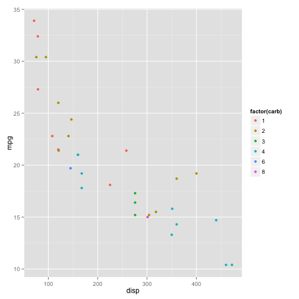
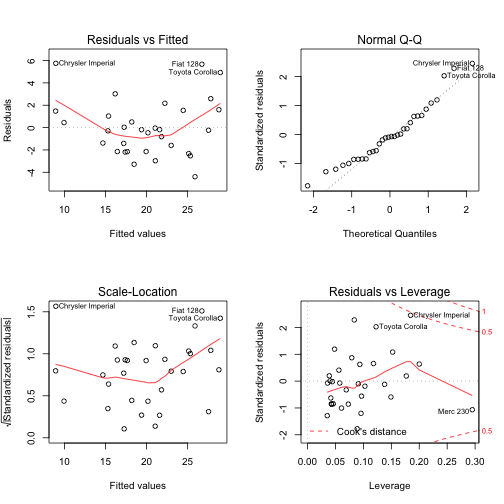

## Executive summary

 

In this report, we investigate the relationship between MPG (Miles per Gallon) and several variables within the dataset **mtcars**. 
The data was extracted from the 1974 Motor Trend US magazine, and comprises fuel consumption and 10 aspects of automobile design and performance for 32 automobiles (1973–74 models). 
We will first show that using a manual transmission rather than an automatic one seems to lead to a larger MPG.
Though, when we try to find a clear relationship between MPG and the transmission, we cannot just stop there and we must investigate further, considering a lot of other features that are at stake.
The conclusion is, wether in the case of the relationship between MPG and the am variable alone, or with 2 other variables, the cars with manual transmission in this study have on average significantly higher MPG than the cars with automatic transmission.

 

Loading the **mtcars** data

```r
data(mtcars)
```

 

## 1. Is an automatic or manual transmission better for MPG

First let's have a look at the data

```r
head(mtcars)
```

```
##                    mpg cyl disp  hp drat    wt  qsec vs am gear carb
## Mazda RX4         21.0   6  160 110 3.90 2.620 16.46  0  1    4    4
## Mazda RX4 Wag     21.0   6  160 110 3.90 2.875 17.02  0  1    4    4
## Datsun 710        22.8   4  108  93 3.85 2.320 18.61  1  1    4    1
## Hornet 4 Drive    21.4   6  258 110 3.08 3.215 19.44  1  0    3    1
## Hornet Sportabout 18.7   8  360 175 3.15 3.440 17.02  0  0    3    2
## Valiant           18.1   6  225 105 2.76 3.460 20.22  1  0    3    1
```


```r
str(mtcars)
```

```
## 'data.frame':	32 obs. of  11 variables:
##  $ mpg : num  21 21 22.8 21.4 18.7 18.1 14.3 24.4 22.8 19.2 ...
##  $ cyl : num  6 6 4 6 8 6 8 4 4 6 ...
##  $ disp: num  160 160 108 258 360 ...
##  $ hp  : num  110 110 93 110 175 105 245 62 95 123 ...
##  $ drat: num  3.9 3.9 3.85 3.08 3.15 2.76 3.21 3.69 3.92 3.92 ...
##  $ wt  : num  2.62 2.88 2.32 3.21 3.44 ...
##  $ qsec: num  16.5 17 18.6 19.4 17 ...
##  $ vs  : num  0 0 1 1 0 1 0 1 1 1 ...
##  $ am  : num  1 1 1 0 0 0 0 0 0 0 ...
##  $ gear: num  4 4 4 3 3 3 3 4 4 4 ...
##  $ carb: num  4 4 1 1 2 1 4 2 2 4 ...
```
By looking at the structure of the data, we see that all variables are numerical.

Now let's have a look at the relation between MPG and transmission

```r
library(ggplot2)

g <- ggplot(mtcars, aes(x = factor(am), y = mpg)) + geom_violin()
g
```

 
As we see on this plot, we can suppose that manual transmission (am =1) is associated with a larger MPG.

Let's fit a simple linear regression to check this assumption.

```r
fit1 <- lm(mpg ~ factor(am), data=mtcars)
summary(fit1)
```

```
## 
## Call:
## lm(formula = mpg ~ factor(am), data = mtcars)
## 
## Residuals:
##     Min      1Q  Median      3Q     Max 
## -9.3923 -3.0923 -0.2974  3.2439  9.5077 
## 
## Coefficients:
##             Estimate Std. Error t value Pr(>|t|)    
## (Intercept)   17.147      1.125  15.247 1.13e-15 ***
## factor(am)1    7.245      1.764   4.106 0.000285 ***
## ---
## Signif. codes:  0 '***' 0.001 '**' 0.01 '*' 0.05 '.' 0.1 ' ' 1
## 
## Residual standard error: 4.902 on 30 degrees of freedom
## Multiple R-squared:  0.3598,	Adjusted R-squared:  0.3385 
## F-statistic: 16.86 on 1 and 30 DF,  p-value: 0.000285
```
The coefficients of this model mean :
- if the transmission is automatic, am = 0, the prediction is 17.147, which is the mean of MPG for am == 0;
- if the transmission is manual, am = 1, then the prediction is 17.147 + 7.245 = 24.392 which is the mean of MPG for am == 1;
This is a quite simple model.
Let's see the correlation between the features to choose features to include into a model.

Let's calculate a 95% confidence interval for Beta1.

```r
m <- coef(summary(fit1))[2,1]
se <- coef(summary(fit1))[2,2]
m + c(-1,1)*qt(.975,30)*se # (n = 32 so n-2 = 30)
```

```
## [1]  3.64151 10.84837
```
The confidence interval does not include 0. p-Value for Beta1 is small (2e10-4 < 0.05). The confidence interval is positive. 
So we can reject the null hypothesis and so assume that the means of the 2 groups are significantly different at alpha = 0.05, and furthermore that the mean of the sample with am = 1 is likely to be larger than the mean of the sample with am = 0.

But, as we are aware of, MPG is not only a function of the type of transmission, but it depends on a lot of different features. We are going to investigate those features in the next question.

&nbsp;

## 2. Quantify the MPG difference between automatic and manual transmissions

So, we have seen before that a manual transmission seems to lead to a larger MPG.
But what about the interaction between MPG and the others features. Let's have a look at those with different plots.

```r
library(ggplot2)

g <- ggplot(mtcars, aes(x = factor(am), y = mpg, col = factor(cyl))) + geom_violin(aes(fill = factor(cyl)))
g
```

 

```r
g <- ggplot(mtcars, aes(x = wt, y = mpg, col = factor(gear))) + geom_point()
g
```

 

```r
g <- ggplot(mtcars, aes(x = disp, y = mpg, col = factor(carb))) + geom_point()
g
```

 

So to model the relation between MPG and all of those features, we are going to create several models and compare them to each other.

Let's see the correlation between the features to choose features to include into a model.

```r
cor(mtcars)
```

```
##             mpg        cyl       disp         hp        drat         wt
## mpg   1.0000000 -0.8521620 -0.8475514 -0.7761684  0.68117191 -0.8676594
## cyl  -0.8521620  1.0000000  0.9020329  0.8324475 -0.69993811  0.7824958
## disp -0.8475514  0.9020329  1.0000000  0.7909486 -0.71021393  0.8879799
## hp   -0.7761684  0.8324475  0.7909486  1.0000000 -0.44875912  0.6587479
## drat  0.6811719 -0.6999381 -0.7102139 -0.4487591  1.00000000 -0.7124406
## wt   -0.8676594  0.7824958  0.8879799  0.6587479 -0.71244065  1.0000000
## qsec  0.4186840 -0.5912421 -0.4336979 -0.7082234  0.09120476 -0.1747159
## vs    0.6640389 -0.8108118 -0.7104159 -0.7230967  0.44027846 -0.5549157
## am    0.5998324 -0.5226070 -0.5912270 -0.2432043  0.71271113 -0.6924953
## gear  0.4802848 -0.4926866 -0.5555692 -0.1257043  0.69961013 -0.5832870
## carb -0.5509251  0.5269883  0.3949769  0.7498125 -0.09078980  0.4276059
##             qsec         vs          am       gear        carb
## mpg   0.41868403  0.6640389  0.59983243  0.4802848 -0.55092507
## cyl  -0.59124207 -0.8108118 -0.52260705 -0.4926866  0.52698829
## disp -0.43369788 -0.7104159 -0.59122704 -0.5555692  0.39497686
## hp   -0.70822339 -0.7230967 -0.24320426 -0.1257043  0.74981247
## drat  0.09120476  0.4402785  0.71271113  0.6996101 -0.09078980
## wt   -0.17471588 -0.5549157 -0.69249526 -0.5832870  0.42760594
## qsec  1.00000000  0.7445354 -0.22986086 -0.2126822 -0.65624923
## vs    0.74453544  1.0000000  0.16834512  0.2060233 -0.56960714
## am   -0.22986086  0.1683451  1.00000000  0.7940588  0.05753435
## gear -0.21268223  0.2060233  0.79405876  1.0000000  0.27407284
## carb -0.65624923 -0.5696071  0.05753435  0.2740728  1.00000000
```

```r
a
```

```
##            mpg       cyl      disp        hp       drat        wt
## mpg  1.0000000 0.8521620 0.8475514 0.7761684 0.68117191 0.8676594
## cyl  0.8521620 1.0000000 0.9020329 0.8324475 0.69993811 0.7824958
## disp 0.8475514 0.9020329 1.0000000 0.7909486 0.71021393 0.8879799
## hp   0.7761684 0.8324475 0.7909486 1.0000000 0.44875912 0.6587479
## drat 0.6811719 0.6999381 0.7102139 0.4487591 1.00000000 0.7124406
## wt   0.8676594 0.7824958 0.8879799 0.6587479 0.71244065 1.0000000
## qsec 0.4186840 0.5912421 0.4336979 0.7082234 0.09120476 0.1747159
## vs   0.6640389 0.8108118 0.7104159 0.7230967 0.44027846 0.5549157
## am   0.5998324 0.5226070 0.5912270 0.2432043 0.71271113 0.6924953
## gear 0.4802848 0.4926866 0.5555692 0.1257043 0.69961013 0.5832870
## carb 0.5509251 0.5269883 0.3949769 0.7498125 0.09078980 0.4276059
##            qsec        vs         am      gear       carb
## mpg  0.41868403 0.6640389 0.59983243 0.4802848 0.55092507
## cyl  0.59124207 0.8108118 0.52260705 0.4926866 0.52698829
## disp 0.43369788 0.7104159 0.59122704 0.5555692 0.39497686
## hp   0.70822339 0.7230967 0.24320426 0.1257043 0.74981247
## drat 0.09120476 0.4402785 0.71271113 0.6996101 0.09078980
## wt   0.17471588 0.5549157 0.69249526 0.5832870 0.42760594
## qsec 1.00000000 0.7445354 0.22986086 0.2126822 0.65624923
## vs   0.74453544 1.0000000 0.16834512 0.2060233 0.56960714
## am   0.22986086 0.1683451 1.00000000 0.7940588 0.05753435
## gear 0.21268223 0.2060233 0.79405876 1.0000000 0.27407284
## carb 0.65624923 0.5696071 0.05753435 0.2740728 1.00000000
```
The variable the more correlated with MPG is `wt`.
Then we are going to add the variable the less corelated with `wt` which is `qsec`. And then we add the variable of interest here which is `am`.

Let's build those models.

```r
fit1 <- lm(mpg ~ wt, data=mtcars)
fit2 <- lm(mpg ~ wt + qsec, data=mtcars)
fit3 <- lm(mpg ~ wt + qsec + factor(am), data=mtcars)

anova(fit1,fit2, fit3)
```

```
## Analysis of Variance Table
## 
## Model 1: mpg ~ wt
## Model 2: mpg ~ wt + qsec
## Model 3: mpg ~ wt + qsec + factor(am)
##   Res.Df    RSS Df Sum of Sq       F    Pr(>F)    
## 1     30 278.32                                   
## 2     29 195.46  1    82.858 13.7048 0.0009286 ***
## 3     28 169.29  1    26.178  4.3298 0.0467155 *  
## ---
## Signif. codes:  0 '***' 0.001 '**' 0.01 '*' 0.05 '.' 0.1 ' ' 1
```
As we can see with this comparison, the 2nd and the third models seem to be significant, with a p_value very small, which leads us to reject the null hypothesis, and so to suppose that these models lead to an improvement in comparison of the model 1.

Let's go further with the 3rd model.

```r
summary(fit3)
```

```
## 
## Call:
## lm(formula = mpg ~ wt + qsec + factor(am), data = mtcars)
## 
## Residuals:
##     Min      1Q  Median      3Q     Max 
## -3.4811 -1.5555 -0.7257  1.4110  4.6610 
## 
## Coefficients:
##             Estimate Std. Error t value Pr(>|t|)    
## (Intercept)   9.6178     6.9596   1.382 0.177915    
## wt           -3.9165     0.7112  -5.507 6.95e-06 ***
## qsec          1.2259     0.2887   4.247 0.000216 ***
## factor(am)1   2.9358     1.4109   2.081 0.046716 *  
## ---
## Signif. codes:  0 '***' 0.001 '**' 0.01 '*' 0.05 '.' 0.1 ' ' 1
## 
## Residual standard error: 2.459 on 28 degrees of freedom
## Multiple R-squared:  0.8497,	Adjusted R-squared:  0.8336 
## F-statistic: 52.75 on 3 and 28 DF,  p-value: 1.21e-11
```
All the variables are significant in this model.

Let's calculate a 95% confidence interval for Beta3.

```r
m <- coef(summary(fit3))[4,1]
se <- coef(summary(fit3))[4,2]
m + c(-1,1)*qt(.975,30)*se # (n = 32 so n-2 = 30)
```

```
## [1] 0.05438576 5.81728862
```
The confidence interval does not include 0. p-Value for Beta1 is small (4e10-2 < 0.05). The confidence interval is positive. 
So we can reject the null hypothesis and so assume that the means of the 2 groups are significantly different at alpha = 0.05, and furthermore that the mean of the sample with am = 1 is likely to be larger than the mean of the sample with am = 0.

Let's plot the fit3 to see the residuals

```r
par(mfrow=c(2,2))
plot(fit2)
```

 
As we can see from those plots :
- The Residual vs Fitted and the Scale-Location plots show that there is a slight curve, indicating a slight pattern (to be investigated). And several points seem to be outliers, exercing an influence over the curve, for example Toyota Corolla (row 20)
- the normal Q-Q plot indicates that the residuals tend to follow a normal distribution, so that the points lie on the line, except for the outliers at the top-right.
- Finally, the Residuals vs Leverage points out those outliers, but indicates that those outliers are within the confidence interval (so not really outliers).
